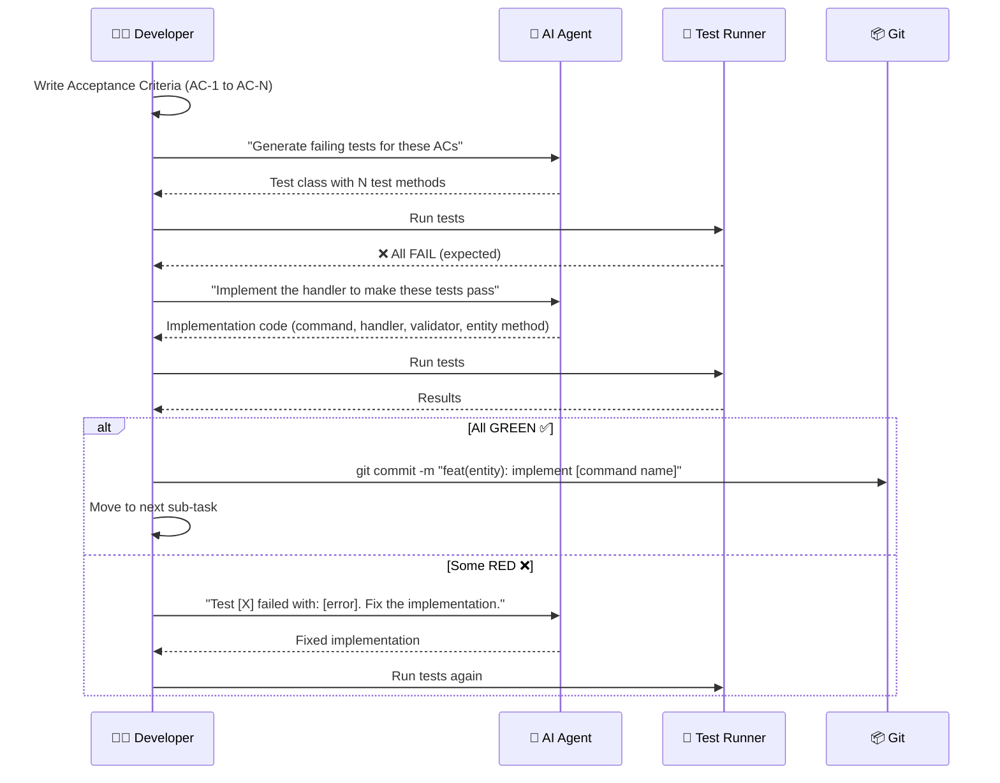
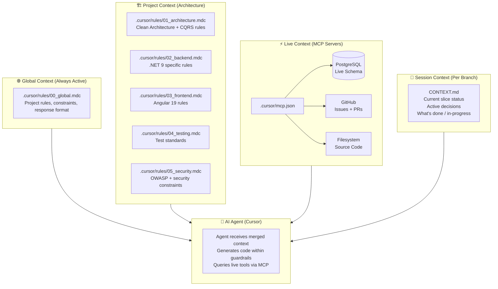
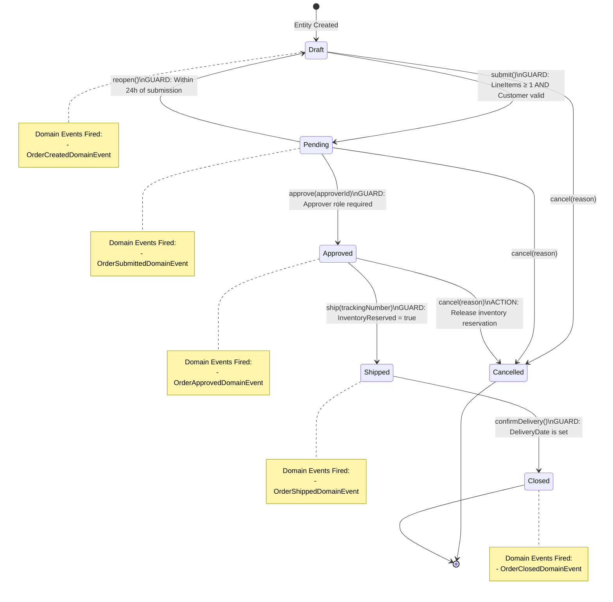
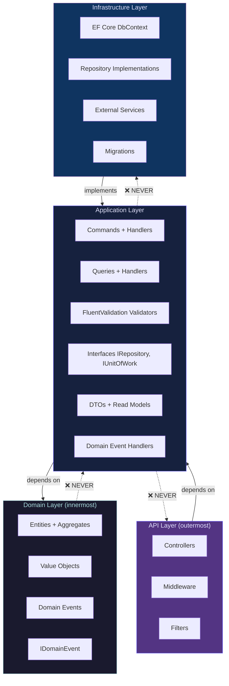
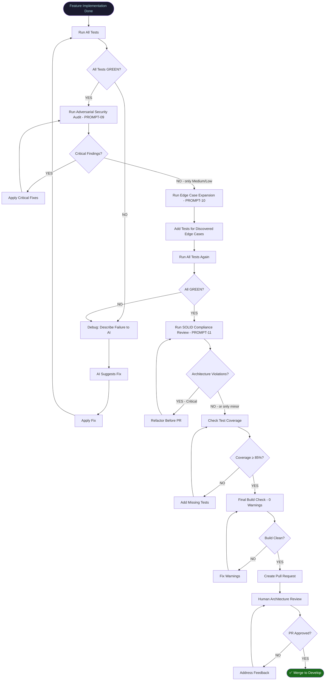
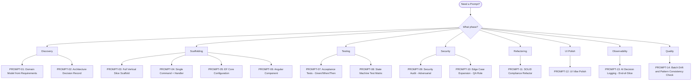
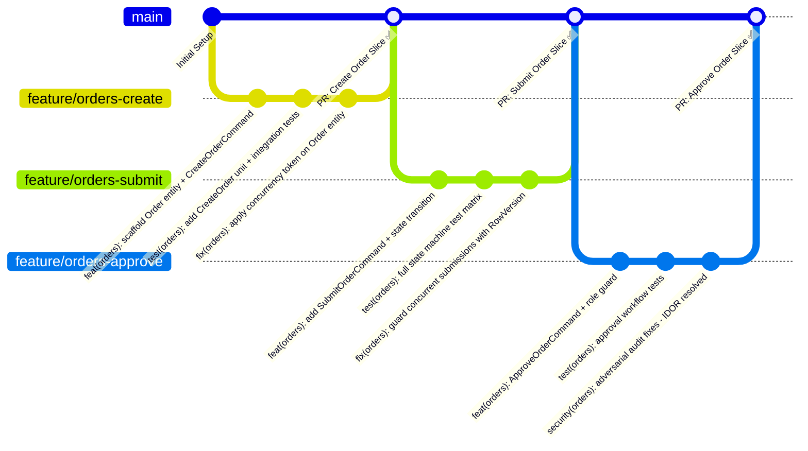

# Document 06: Workflow Diagrams & Process Maps

> **Suite:** Vibe Coding Best Approach v2.0  
> **Purpose:** Visual reference for the complete AI-Assisted Development SDLC

---

## Diagram 1: The Complete AI-Assisted SDLC Overview

```mermaid
flowchart TD
    A([🚀 Project Start]) --> B

    subgraph Phase1["Phase 1: Discovery & Context Setup"]
        B[Feed Raw Requirements to AI] --> C[Generate Domain Model + Mermaid ERD]
        C --> D[Generate Sequence Diagrams per Workflow]
        D --> E[Create .cursor/rules/*.mdc Files]
        E --> F[Configure mcp.json for Live Data Access]
        F --> G[Create CONTEXT.md Snapshot]
    end

    G --> H

    subgraph Phase2["Phase 2: Slice Planning"]
        H[Decompose Module into Vertical Slices] --> I[Prioritize Slices by Business Value]
        I --> J[Write Acceptance Criteria for Slice 1]
        J --> K[Create Feature Branch]
    end

    K --> L

    subgraph Phase3["Phase 3: Test-Driven Generation - TDG Loop"]
        L[PROMPT-07: Generate Failing Tests First] --> M{Tests Confirm FAIL?}
        M -->|YES| N[PROMPT-03/04: Generate Implementation]
        M -->|NO| L
        N --> O[Run Tests]
        O --> P{All GREEN?}
        P -->|YES| Q[Atomic Git Commit]
        P -->|NO| R[Debug with AI - Describe Failure]
        R --> N
    end

    Q --> S

    subgraph Phase4["Phase 4: State Machine Hardening"]
        S{Has State Machine?} -->|YES| T[PROMPT-08: Generate Full Transition Test Matrix]
        S -->|NO| W
        T --> U[Implement Invalid Transition Guards]
        U --> V[Run State Machine Tests - All GREEN]
        V --> W[Update CONTEXT.md]
    end

    W --> X

    subgraph Phase5["Phase 5: Adversarial Verification"]
        X[PROMPT-09: Security Audit] --> Y[Apply Critical + High Fixes]
        Y --> Z[PROMPT-10: Edge Case Expansion]
        Z --> AA[Add Edge Case Tests]
        AA --> AB{Any Critical Findings?}
        AB -->|YES| X
        AB -->|NO| AC[PROMPT-11: SOLID Compliance Review]
        AC --> AD[Apply Architecture Fixes]
    end

    AD --> AE

    subgraph Phase6["Phase 6: Polish & Merge"]
        AE[PROMPT-12: UI/UX Vibe Polish] --> AF[Accessibility Check]
        AF --> AG[Final Build - 0 Warnings]
        AG --> AH{Coverage ≥ 85%?}
        AH -->|NO| AI[Add Missing Tests]
        AI --> AH
        AH -->|YES| AJ[Create Pull Request]
        AJ --> AK[Architecture Review - Human]
        AK --> AL{Approved?}
        AL -->|NO| AM[Address Review Comments]
        AM --> AJ
        AL -->|YES| AN[Merge to Develop]
    end

    AN --> AO{More Slices?}
    AO -->|YES| J
    AO -->|NO| AP([✅ Module Complete])

    style Phase1 fill:#1a1a2e,color:#e0e0ff,stroke:#6c63ff
    style Phase2 fill:#16213e,color:#e0e0ff,stroke:#6c63ff
    style Phase3 fill:#0f3460,color:#e0e0ff,stroke:#6c63ff
    style Phase4 fill:#1a1a2e,color:#e0e0ff,stroke:#6c63ff
    style Phase5 fill:#16213e,color:#e0e0ff,stroke:#533483
    style Phase6 fill:#0f3460,color:#e0e0ff,stroke:#533483
```



---

## Diagram 2: The Micro-TDD Loop (Per Feature)



---

## Diagram 3: Context Orchestration Architecture



---

## Diagram 4: State Machine Design Pattern



---

## Diagram 5: Clean Architecture Dependency Flow



---

## Diagram 6: Verification Loop Decision Tree



---

## Diagram 7: Prompt Selection Guide



---

## Diagram 8: Git Branch Strategy for AI Development



---

## Quick Reference: The Daily Developer Rhythm

```
MORNING SETUP (15 min)
├── 5-Minute Pre-Flight: dotnet build + dotnet test + git status ← NEW
├── Review CONTEXT.md — what's the current slice?
├── Update .cursor/rules/ if architectural decisions changed
├── Create/switch to feature branch for today's slice
└── Write acceptance criteria for today's target

DEVELOPMENT CYCLE (Repeat per task)
├── Use PROMPT-07/08 → Generate tests first
├── Confirm tests FAIL
├── Use PROMPT-03/04/05/06 → Generate implementation
├── Run tests → Fix until GREEN
└── Atomic commit

AFTERNOON HARDENING (30-45 min per slice)
├── Use PROMPT-09 → Security audit
├── Apply Critical + High fixes
├── Use PROMPT-10 → Edge case expansion
├── Add missing tests → All green
└── Use PROMPT-11 → SOLID review

OBSERVABILITY STEP (10 min per slice) ← NEW
├── Use PROMPT-13 → Generate AI_DECISIONS.md entry
├── Review: any Low confidence areas?
├── Track assumptions with stakeholders
└── Commit AI_DECISIONS.md alongside code

DRIFT CHECK (15 min — every 3rd slice) ← NEW
├── Use PROMPT-14 → Batch drift analysis
├── Consistency scores all ≥ 85%?
├── Update .cursor/rules/ for any DRIFT items found
└── Flag IMPROVEMENT items for canonical promotion

END OF DAY (15 min)
├── Update CONTEXT.md with completed work
├── Push branch to remote
├── Create PR draft (if slice is complete)
└── Update AI_QUALITY_SCORECARD.md with today's slice scores
```

---

## Appendix: IDE-Specific Quick Reference Cards

> **From External Analysis — Priority 🟢 Polish**

### Cursor IDE

| Action | How To Do It |
|---|---|
| Apply global rule file | `@.cursor/rules/00_global.mdc` in chat |
| Reference canonical file | `@src/Application/Orders/Commands/CreateOrder/CreateOrderCommandHandler.cs` |
| Load context snapshot | `@CONTEXT.md` at start of session |
| Toggle MCP tools | **Settings → Tools & MCP** → toggle servers |
| Scope agent to one file | Drag the file into chat context window |
| Stop agent mid-generation | `Escape` key or click the stop button immediately |
| Start fresh session | Open new chat tab (clears context, avoids context spiral) |
| Dry-run before file write | Add "Show me a plan first" to your prompt |
| Revert AI changes | `Ctrl+Z` for in-editor changes; `git stash` for committed changes |

### Windsurf IDE (Cascade)

| Action | How To Do It |
|---|---|
| Apply project rules | Place rules in `.windsurf/rules/` directory |
| Step-through debugging | Say "Explain this step by step" in Cascade chat |
| Pause and plan | Add "Wait for my approval" to multi-step tasks |
| Reference specific file | `@filename` syntax in Cascade |
| Revert a Flow step | Use Cascade's built-in step revert button |

### VS Code + GitHub Copilot

| Action | How To Do It |
|---|---|
| Multi-file edit (Copilot Edits) | `Ctrl+Shift+I` → "Edit in workspace" |
| Inline chat | `Ctrl+I` (Windows) / `Cmd+I` (Mac) |
| Attach file to context | Click the `+` icon in chat to attach files |
| Reference whole codebase | Enable "@workspace" mode in chat |
| Create reusable instructions | `.github/copilot-instructions.md` |
| Dry-run | "Describe what you will change, don't edit yet" |

### Trae IDE

| Action | How To Do It |
|---|---|
| Project rules | Via system prompt configuration in workspace settings |
| Agent mode | Use "Builder" mode for multi-file generation |
| Stop agent | Click stop button; Trae has strong undo history |
| Context management | Manually include relevant files via `@` mentions |

---

*This document is the visual companion to the full Best Approach documentation suite (v2.1). For detailed implementation guidance, refer to documents 01 through 10.*
