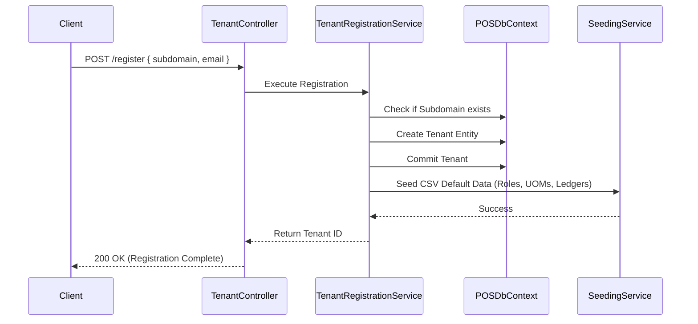

# Module: Tenant Management & Multi-Tenancy

**Location:** `f:\MIllyass\pos-with-inventory-management\Documentation\Verification\01_Tenant_Management_and_Licensing.md`

## 1. Purpose & Scope
This module handles multi-tenant registration, SaaS licensing, API key management, and data isolation. It guarantees that all requests are securely scoped to a single tenant using subdomain detection or HTTP headers, preventing cross-tenant data leakage.

## 2. Vertical Slice Architecture (Vibe Coding Framework)
- **Entry Point:** `TenantsController.cs` (`POST /api/Tenants/register`)
- **Application Layer:** `RegisterTenantCommandHandler`, `ValidateLicenseCommandHandler`, `UpdateTenantLicenseCommandHandler`
- **Domain Layer:** `Tenant`, `License`, `CompanyProfile`
- **Infrastructure Layer:** `TenantRegistrationService`, `TenantInitializationService`, `TenantResolutionMiddleware`, `TrialEnforcementMiddleware`

## 3. Data Flow Diagram

## 4. Dependencies & Interfaces
- **`ITenantProvider`**: Scopes EF Core global query filters by returning the current `TenantId`.
- **`ITenantRegistrationService`**: Clones master data from CSVs into the new tenant's schema.
- **`IMemoryCache`**: Caches the `TenantId` resolution and `CompanyProfile_License:{tenantId}` to minimize database hits.

## 5. Configuration Requirements
- `appsettings.json` -> `"MasterTenantSettings"` (defines the global SuperAdmin capable of viewing all tenants).
- `appsettings.json` -> `"TenantConfig"` (defines trial period days, default user limits).

## 6. Test Coverage Metrics
- **Unit Tests:** `POS.MediatR.Tests` (Coverage goal: >80% for Handlers)
- **Integration Tests:** `POS.API.Tests` covering `TrialEnforcementMiddleware` blocking expired tenants.
- **Security Check:** `TenantResolutionMiddleware` ensures `X-Tenant-ID` cannot be spoofed without `isSuperAdmin` claim.

## 7. Vibe Coding Prompt Template
*Use this prompt to instruct the AI when modifying this module:*
> "You are an ASP.NET Core Clean Architecture expert. I need to modify the Tenant Management module. The entry point is `TenantsController.cs`. I want to add a feature that allows a SuperAdmin to suspend a tenant immediately. Create a MediatR command `SuspendTenantCommand`, a handler that sets `IsActive = false`, and write an xUnit integration test in `POS.API.Tests` to verify that suspended tenants receive a `403 Forbidden` response from the `TrialEnforcementMiddleware`. Ensure all cache entries are invalidated."

## 8. Change History & Version Control
| Date | Version | Author | Notes |
|---|---|---|---|
| Today | 1.0.0 | AI Pair-Programmer | Documented tenant isolation and licensing workflows. |
