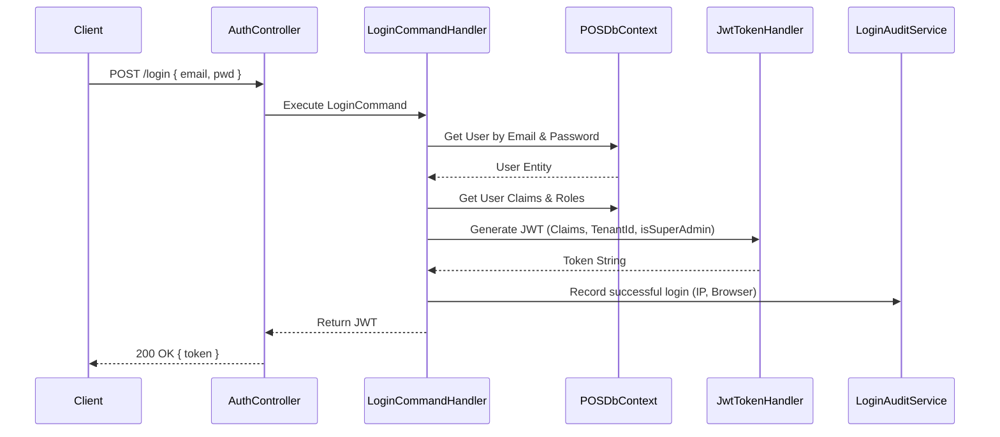

# Module: Authentication & Security

**Location:** `f:\MIllyass\pos-with-inventory-management\Documentation\Verification\02_Authentication_and_Security.md`

## 1. Purpose & Scope
This module handles user authentication, JWT issuance, Role-Based Access Control (RBAC), and Login Auditing. It ensures that only authorized users can access specific endpoints based on assigned claims.

## 2. Vertical Slice Architecture (Vibe Coding Framework)
- **Entry Point:** `AuthenticationController.cs` (`POST /api/authentication/login`)
- **Application Layer:** `LoginCommandHandler`, `UserClaimQueryHandler`, `RoleQueryHandler`
- **Domain Layer:** `User`, `Role`, `UserRole`, `RoleClaim`, `UserClaim`, `LoginAudit`
- **Infrastructure Layer:** `JwtTokenHandler`, `POSDbContext`, `IUserInfoToken`

## 3. Data Flow Diagram

## 4. Dependencies & Interfaces
- **`IJwtTokenHandler`**: Generates standard bearer tokens with custom claims (e.g., `TenantId`, `isSuperAdmin`, `UserId`).
- **`IUserInfoToken`**: Resolves the current `UserId` from the `HttpContext.User` claims principal.
- **`ClaimCheckAttribute`**: An ASP.NET Core Action Filter that restricts endpoints based on specific string claims (e.g., `[ClaimCheck("PRO_ADD_PRODUCT")]`).

## 5. Configuration Requirements
- `appsettings.json` -> `"Jwt"` (defines `Key`, `Issuer`, `Audience`, `DurationInMinutes`).
- JWT Keys must be at least 256-bit (32 bytes) for HMAC-SHA256.

## 6. Test Coverage Metrics
- **Unit Tests:** Validate `JwtTokenHandler` correctly serializes all claims.
- **Integration Tests:** Ensure endpoints decorated with `[ClaimCheck]` return `403 Forbidden` when hit by a user without the claim.

## 7. Vibe Coding Prompt Template
*Use this prompt to instruct the AI when modifying this module:*
> "You are an expert in ASP.NET Core Identity and JWT authentication. I need to modify the Authentication module to add MFA (Multi-Factor Authentication). Update the `LoginCommandHandler` to check if MFA is enabled on the `User` entity. If yes, return a temporary token and a `RequiresMfa` flag instead of the full JWT. Create a new `VerifyMfaCommand` to finalize the login. Implement the frontend Angular component to handle this MFA screen, and write an xUnit integration test to verify the MFA flow end-to-end."

## 8. Change History & Version Control
| Date | Version | Author | Notes |
|---|---|---|---|
| Today | 1.0.0 | AI Pair-Programmer | Documented authentication and RBAC logic. |
