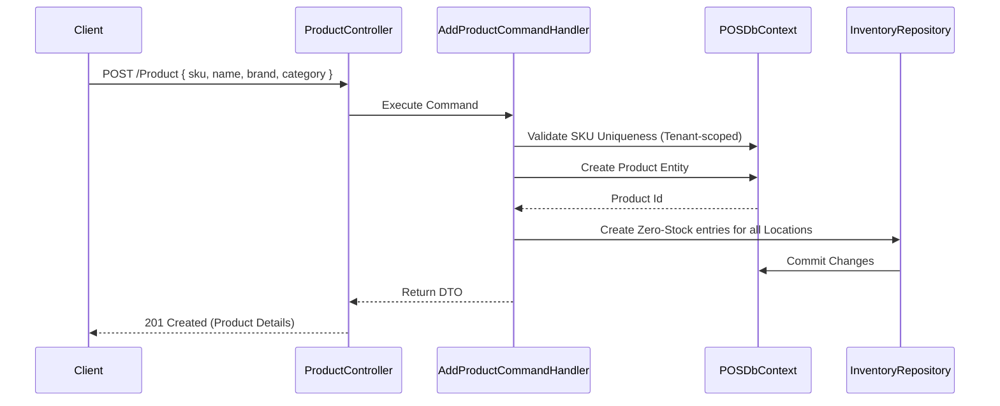

# Module: Inventory & Product Management

**Location:** `f:\MIllyass\pos-with-inventory-management\Documentation\Verification\03_Inventory_and_Product_Management.md`

## 1. Purpose & Scope
This module handles all core inventory and product configurations for the POS. It manages product hierarchies (Brands, Categories), variations (Variants), UOM (Units of Measurement), Stock (Locations, Adjustments), and Damaged Stock processing.

## 2. Vertical Slice Architecture (Vibe Coding Framework)
- **Entry Point:** `ProductController.cs`, `BrandController.cs`, `ProductCategoryController.cs`, `UnitConversationController.cs`
- **Application Layer:** `AddProductCommandHandler`, `UpdateProductCommandHandler`, `DeleteProductCommandHandler`, `GetAllProductQueryHandler`
- **Domain Layer:** `Product`, `Brand`, `ProductCategory`, `UnitConversation`, `Inventory`, `DamagedStock`, `Variant`
- **Infrastructure Layer:** `POSDbContext`, `IUnitOfWork`, `IInventoryRepository`

## 3. Data Flow Diagram

## 4. Dependencies & Interfaces
- **`IInventoryRepository`**: Abstraction for retrieving real-time stock counts across multiple locations, handling adjustments.
- **`POSDbContext`**: Uses `HasQueryFilter(x => x.TenantId == _tenantProvider.TenantId)` to isolate product catalogs.
- **AutoMapper**: Maps `ProductCommand` to `Product` entity and `Product` to `ProductDto`.

## 5. Configuration Requirements
- All UOM conversions require a designated Base Unit.
- `SKU` constraints are tenant-scoped (Tenant A and Tenant B can both have an SKU of "IPHONE", but Tenant A cannot have two).

## 6. Test Coverage Metrics
- **Unit Tests:** Validate `UnitConversation` logic (e.g., 1 Box = 10 Pieces).
- **Integration Tests:** Ensure stock reductions properly decrease `Inventory` records and cannot go below 0 unless negative inventory is explicitly enabled in `StoreSettings`.

## 7. Vibe Coding Prompt Template
*Use this prompt to instruct the AI when modifying this module:*
> "You are an expert in C#, Clean Architecture, and Inventory algorithms. I want to add an 'Average Cost' calculation feature to the `Product` entity. Every time a `PurchaseOrder` is received, I need a MediatR Domain Event `StockReceivedEvent` to trigger a handler `UpdateProductAverageCostEventHandler`. This handler will fetch all existing stock, average the new purchase price against the old, and update `Product.AverageCost`. Write the handler, update the EF Core mapping, and write a unit test to verify the mathematical calculation."

## 8. Change History & Version Control
| Date | Version | Author | Notes |
|---|---|---|---|
| Today | 1.0.0 | AI Pair-Programmer | Documented product catalog and inventory logic. |
