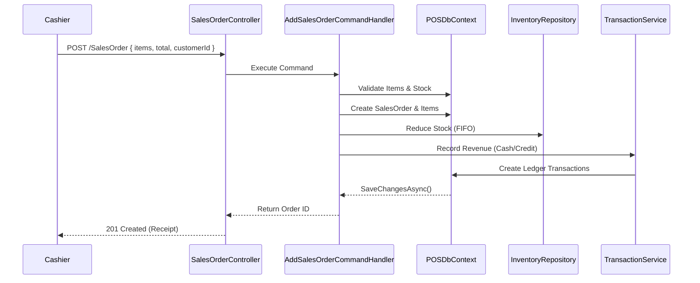

# Module: Sales & POS Terminal

**Location:** `f:\MIllyass\pos-with-inventory-management\Documentation\Verification\04_Sales_and_POS_Terminal.md`

## 1. Purpose & Scope
This module handles all customer transactions, including POS checkout, walk-in sales, B2B credit sales (Sales Orders), customer ledgers, and payment processing. It integrates directly with Inventory (to reduce stock) and Accounting (to record revenue).

## 2. Vertical Slice Architecture (Vibe Coding Framework)
- **Entry Point:** `SalesOrderController.cs`, `StoreController.cs`, `CustomerController.cs`, `SalesOrderPaymentController.cs`
- **Application Layer:** `AddSalesOrderCommandHandler`, `AddSalesOrderPaymentCommandHandler`, `GetAllSalesOrderQueryHandler`
- **Domain Layer:** `SalesOrder`, `SalesOrderItem`, `Customer`, `SalesOrderPayment`, `Inventory`, `Transaction`
- **Infrastructure Layer:** `POSDbContext`, `IUnitOfWork`, `IInventoryRepository`, `ITransactionService`

## 3. Data Flow Diagram

## 4. Dependencies & Interfaces
- **`ITransactionService`**: Creates Double-Entry Accounting records (e.g., Debit Cash, Credit Revenue).
- **`IInventoryRepository`**: Ensures stock is reduced correctly across UOMs.
- **`ICustomerService`**: Checks credit limits for B2B Sales Orders before approving "Unpaid" orders.

## 5. Configuration Requirements
- POS Terminals must be assigned a `LocationId` to deduct stock from the correct warehouse.
- Default Walk-in Customer ID must exist for anonymous sales.

## 6. Test Coverage Metrics
- **Unit Tests:** Validate tax calculations, discounts, and line-item totals in `AddSalesOrderCommandHandler`.
- **Integration Tests:** Verify that completing a Sale correctly decreases `Inventory` and increases `SalesRevenue` in the Ledger.

## 7. Vibe Coding Prompt Template
*Use this prompt to instruct the AI when modifying this module:*
> "You are an expert in Point of Sale architecture and Double-Entry Accounting. I need to modify the Sales & POS Terminal module. The entry point is `SalesOrderController.cs`. I want to add a feature to handle 'Returns/Refunds' (a `ReturnSalesOrderCommand`). When a sale is returned, the system must 1) increase the inventory back to its original state, 2) create a reversing Ledger entry (Debit Revenue, Credit Cash), and 3) mark the original `SalesOrder.Status` as 'Returned'. Write the command, handler, and xUnit integration test to ensure all three systems update atomically."

## 8. Change History & Version Control
| Date | Version | Author | Notes |
|---|---|---|---|
| Today | 1.0.0 | AI Pair-Programmer | Documented POS checkout, Sales Orders, and financial flow. |
