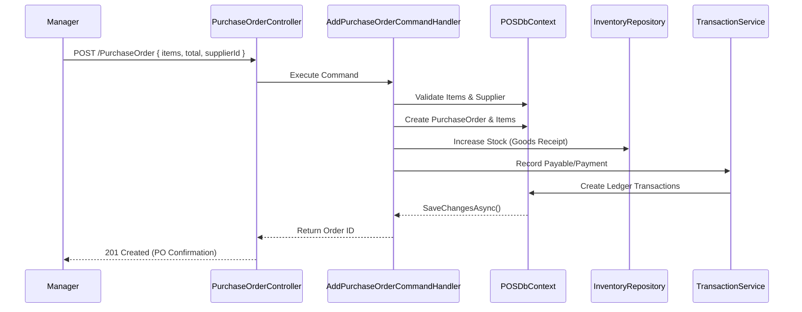

# Module: Purchasing & Supplier Management

**Location:** `f:\MIllyass\pos-with-inventory-management\Documentation\Verification\05_Purchasing_and_Supplier_Management.md`

## 1. Purpose & Scope
This module handles restocking inventory by creating Purchase Orders (POs), receiving goods from Suppliers, and processing payments against Accounts Payable. It maintains vendor profiles and tracks the cost of goods sold (COGS).

## 2. Vertical Slice Architecture (Vibe Coding Framework)
- **Entry Point:** `PurchaseOrderController.cs`, `SupplierController.cs`, `PurchaseOrderPaymentController.cs`
- **Application Layer:** `AddPurchaseOrderCommandHandler`, `UpdatePurchaseOrderCommandHandler`, `AddPurchaseOrderPaymentCommandHandler`
- **Domain Layer:** `PurchaseOrder`, `PurchaseOrderItem`, `Supplier`, `PurchaseOrderPayment`, `Inventory`, `Transaction`
- **Infrastructure Layer:** `POSDbContext`, `IUnitOfWork`, `IInventoryRepository`, `ITransactionService`

## 3. Data Flow Diagram

## 4. Dependencies & Interfaces
- **`ITransactionService`**: Creates Double-Entry Accounting records (e.g., Credit Accounts Payable, Debit Inventory Asset).
- **`IInventoryRepository`**: Increases stock correctly across UOMs based on PO quantities.
- **`ISupplierService`**: Tracks total outstanding balances per supplier.

## 5. Configuration Requirements
- PO Statuses typically follow a workflow: Draft -> Approved -> Received -> Paid.
- Goods must be assigned to a specific `LocationId` upon receipt.

## 6. Test Coverage Metrics
- **Unit Tests:** Validate PO total cost calculations, including taxes and discounts.
- **Integration Tests:** Verify that "Receiving" a PO increases `Inventory` and creates the correct Accounts Payable ledger entry.

## 7. Vibe Coding Prompt Template
*Use this prompt to instruct the AI when modifying this module:*
> "You are an expert in Inventory Costing and Clean Architecture. I need to modify the Purchasing & Supplier module. The entry point is `PurchaseOrderController.cs`. I want to add a feature to handle 'Partial Receipts' (a `ReceivePartialPurchaseOrderCommand`). Currently, POs are received in full. Create a new Domain Entity `PurchaseReceipt` linked to the `PurchaseOrder`, handle partial stock increases, and write an xUnit integration test to verify the remaining quantities are tracked correctly until the PO is fully closed."

## 8. Change History & Version Control
| Date | Version | Author | Notes |
|---|---|---|---|
| Today | 1.0.0 | AI Pair-Programmer | Documented PO creation, goods receipt, and supplier flow. |
