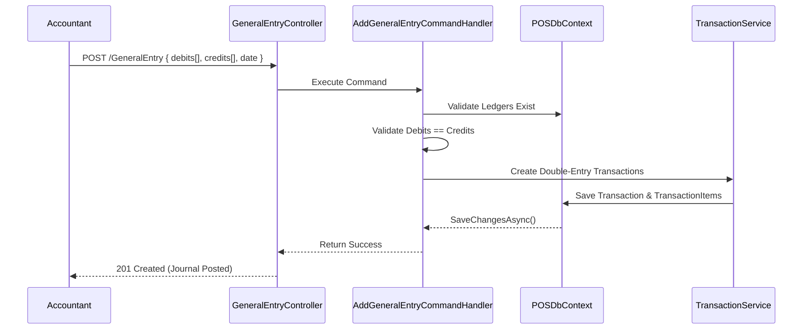

# Module: Accounting & Financials

**Location:** `f:\MIllyass\pos-with-inventory-management\Documentation\Verification\06_Accounting_and_Financials.md`

## 1. Purpose & Scope
This module handles all core financial reporting and Double-Entry Accounting operations. It manages the Chart of Accounts (Ledger Accounts), Direct Expenses, General Journal Entries, Trial Balance, Profit/Loss generation, and Year-End Closings.

## 2. Vertical Slice Architecture (Vibe Coding Framework)
- **Entry Point:** `GeneralEntryController.cs`, `LedgerAccountController.cs`, `ExpenseController.cs`, `TransactionController.cs`
- **Application Layer:** `AddGeneralEntryCommandHandler`, `AddExpenseCommandHandler`, `GetAllLedgerAccountQueryHandler`
- **Domain Layer:** `LedgerAccount`, `GeneralEntry`, `Transaction`, `TransactionItem`, `Expense`, `FinancialYear`
- **Infrastructure Layer:** `POSDbContext`, `IUnitOfWork`, `ITransactionService`

## 3. Data Flow Diagram

## 4. Dependencies & Interfaces
- **`ITransactionService`**: The core accounting engine that ensures the accounting equation (Assets = Liabilities + Equity) is maintained by strictly requiring Debits to equal Credits for every operation.
- **`IUnitOfWork`**: Wraps all accounting operations in a single transaction to prevent partial financial postings.
- **`FinancialYear`**: Groups all transactions logically.

## 5. Configuration Requirements
- A default Chart of Accounts is seeded via `LedgerAccounts.csv` upon Tenant Registration.
- Certain accounts (e.g., Accounts Receivable, Accounts Payable, Cash, Revenue) are mapped to System Accounts to prevent accidental deletion.

## 6. Test Coverage Metrics
- **Unit Tests:** Validate that `AddGeneralEntryCommandHandler` throws an exception if total Debits do not match total Credits.
- **Integration Tests:** Verify that an `Expense` correctly debits the chosen expense ledger and credits the specified asset/cash ledger.

## 7. Vibe Coding Prompt Template
*Use this prompt to instruct the AI when modifying this module:*
> "You are a senior Software Engineer and an expert in Double-Entry Accounting systems. I need to modify the Accounting & Financials module. The entry point is `TransactionController.cs`. I want to add a feature to generate a 'Balance Sheet Report' (a `GetBalanceSheetQuery`). This query should aggregate the total Debits and Credits for all Ledger Accounts of type 'Asset', 'Liability', and 'Equity' up to a specific date. Write the query, the DTO, the EF Core aggregation logic, and write a unit test to verify that Total Assets equals Total Liabilities + Equity."

## 8. Change History & Version Control
| Date | Version | Author | Notes |
|---|---|---|---|
| Today | 1.0.0 | AI Pair-Programmer | Documented general entries, expenses, and double-entry flow. |
