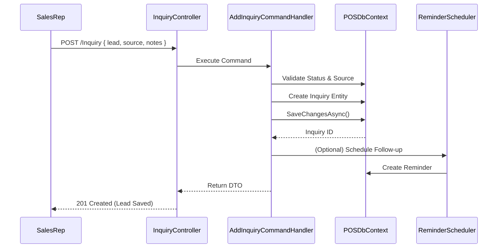

# Module: CRM & Inquiries

**Location:** `f:\MIllyass\pos-with-inventory-management\Documentation\Verification\07_CRM_and_Inquiries.md`

## 1. Purpose & Scope
This module handles all customer relationship management (CRM) functionalities, including tracking sales leads (Inquiries), logging follow-up activities, assigning statuses, tracking inquiry sources, and scheduling reminders. It helps convert prospective leads into actual Customers and Sales Orders.

## 2. Vertical Slice Architecture (Vibe Coding Framework)
- **Entry Point:** `InquiryController.cs`, `InquiryActivityController.cs`, `InquiryAttachmentController.cs`, `ReminderController.cs`
- **Application Layer:** `AddInquiryCommandHandler`, `UpdateInquiryCommandHandler`, `AddInquiryActivityCommandHandler`
- **Domain Layer:** `Inquiry`, `InquiryActivity`, `InquiryAttachment`, `InquiryStatus`, `InquirySource`, `Reminder`
- **Infrastructure Layer:** `POSDbContext`, `IUnitOfWork`, `IEmailService` (for reminders)

## 3. Data Flow Diagram

## 4. Dependencies & Interfaces
- **`IInquiryStatusRepository` / `IInquirySourceRepository`**: Manage dropdown lookups for lead origin and pipeline stage.
- **`IEmailService`**: (Optional) Sends out scheduled reminders to Sales Reps or Customers.

## 5. Configuration Requirements
- Default Inquiry Statuses (e.g., "New", "Contacted", "Closed Won", "Closed Lost") are seeded per tenant.
- Default Inquiry Sources (e.g., "Website", "Walk-in", "Referral") are seeded per tenant.

## 6. Test Coverage Metrics
- **Unit Tests:** Validate that `AddInquiryActivityCommandHandler` correctly associates activities with the parent Inquiry.
- **Integration Tests:** Verify that changing the `InquiryStatusId` updates the global status of the Inquiry entity and triggers any associated Domain Events.

## 7. Vibe Coding Prompt Template
*Use this prompt to instruct the AI when modifying this module:*
> "You are an expert in CRM architecture and Clean Architecture. I need to modify the CRM & Inquiries module. The entry point is `InquiryController.cs`. I want to add a feature to 'Convert Inquiry to Customer'. Create a MediatR command `ConvertInquiryToCustomerCommand`. The handler should: 1) create a new `Customer` record mapping the Inquiry's contact details, 2) update the `InquiryStatus` to 'Closed Won', 3) map the new `CustomerId` back to the Inquiry, and 4) create a Domain Event `InquiryConvertedEvent`. Write the handler, update the EF Core mapping, and write a unit test to verify the conversion logic."

## 8. Change History & Version Control
| Date | Version | Author | Notes |
|---|---|---|---|
| Today | 1.0.0 | AI Pair-Programmer | Documented CRM lead tracking, activities, and reminders flow. |
