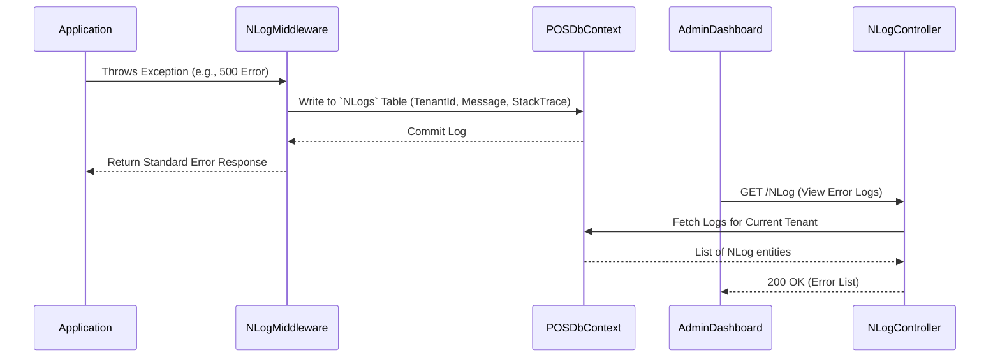

# Module: System Settings & Logs

**Location:** `f:\MIllyass\pos-with-inventory-management\Documentation\Verification\08_System_Settings_and_Logs.md`

## 1. Purpose & Scope
This module handles all application-wide and tenant-specific configuration, logging, database migrations, email integration, and sync operations. It is responsible for error tracking (NLog), sending outgoing emails (Email SMTP Settings, Templates, Email Logs), and managing FBR (Federal Board of Revenue) reporting settings.

## 2. Vertical Slice Architecture (Vibe Coding Framework)
- **Entry Point:** `NLogController.cs`, `EmailSMTPSettingController.cs`, `EmailTemplateController.cs`, `DbMigrationController.cs`, `SyncController.cs`
- **Application Layer:** `GetNLogQueryHandler`, `AddEmailSMTPSettingCommandHandler`, `AddEmailTemplateCommandHandler`, `SendEmailCommandHandler`
- **Domain Layer:** `NLog`, `EmailSMTPSetting`, `EmailTemplate`, `EmailLog`, `CompanyProfile`, `SyncLog`
- **Infrastructure Layer:** `POSDbContext`, `IUnitOfWork`, `IEmailService`, `NLog Logger`

## 3. Data Flow Diagram

## 4. Dependencies & Interfaces
- **`IEmailService`**: Orchestrates sending actual emails using `MailKit` based on the tenant's `EmailSMTPSetting`.
- **`POSDbContext` (Logging Context)**: Contains `DbSet<NLog>` mapped to the `NLogs` table. NLog's database target writes directly here.
- **`TenantProvider`**: Essential for scoping `EmailSMTPSetting` and `NLogs` to the specific tenant, as logs must not leak between companies.

## 5. Configuration Requirements
- `nlog.config` is configured to write logs both to the file system (for fatal crash debugging) and the SQL database (`NLogs` table) for UI rendering.
- `MailKit` dependencies must be up-to-date to prevent SMTP CRLF injection vulnerabilities.

## 6. Test Coverage Metrics
- **Unit Tests:** Verify `SendEmailCommandHandler` replaces template variables correctly (e.g., `{{UserName}}`) using `EmailTemplate`.
- **Integration Tests:** Ensure that when a user creates a new `EmailSMTPSetting`, the system correctly validates the SMTP connection before saving it to the database.

## 7. Vibe Coding Prompt Template
*Use this prompt to instruct the AI when modifying this module:*
> "You are an expert in ASP.NET Core Middleware and Observability. I need to modify the System Settings & Logs module. The entry point is `EmailSMTPSettingController.cs`. I want to add a feature to 'Test SMTP Connection' before saving settings. Create a MediatR command `TestSmtpConnectionCommand`. The handler should use `MailKit` to attempt an authentication login against the provided SMTP server, port, username, and password. If it fails, return a custom error message. Write the handler, update the Angular component to include a 'Test Connection' button, and write an xUnit integration test mocking `MailKit` to verify the logic."

## 8. Change History & Version Control
| Date | Version | Author | Notes |
|---|---|---|---|
| Today | 1.0.0 | AI Pair-Programmer | Documented NLog integration, SMTP settings, and system configuration. |
