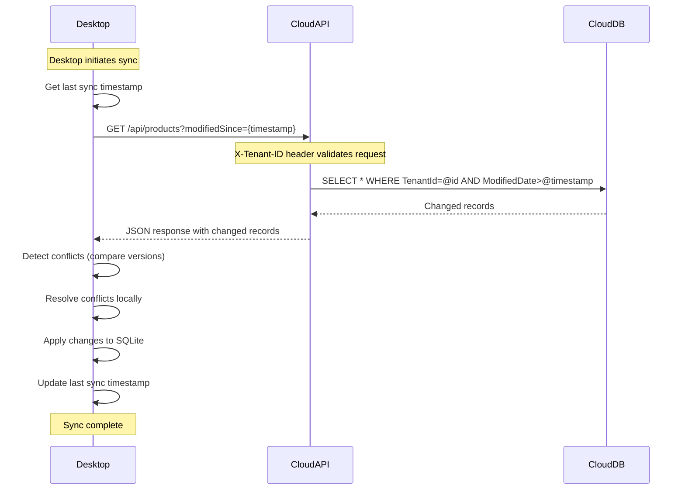
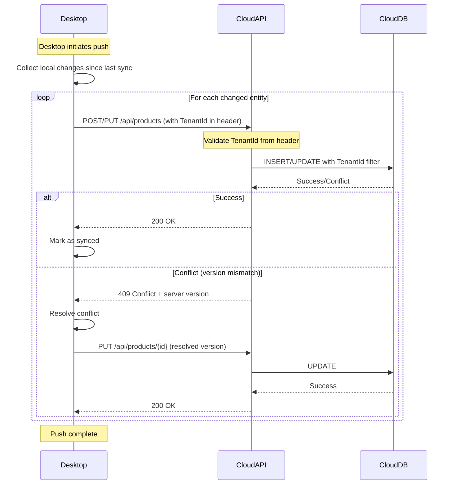

# Data Synchronization Implementation Plan
## Desktop-Driven Sync: SQLite ↔ Cloud SQL Server

---

## Executive Summary

This plan outlines a **Desktop-driven synchronization system** where the Desktop application is responsible for keeping its local SQLite database in sync with the Cloud SQL Server database. The Cloud provides **standard REST APIs** for data access, with **TenantId-based authentication** serving as the API key.

### Key Principles
- 🎯 **Desktop-Driven**: All sync logic resides in Desktop application
- 🔑 **TenantId as API Key**: TenantId serves as authentication for Cloud APIs
- 🌐 **Cloud is Passive**: Cloud only provides standard CRUD APIs
- 📡 **Offline-First**: Desktop works fully offline, syncs when online
- 🔄 **Pull & Push**: Desktop pulls changes from Cloud and pushes local changes
- ⚡ **Simple & Efficient**: No complex sync logic on Cloud side

### Key Objectives
- ✅ **Seamless Experience**: Users see the same data on Desktop and Cloud
- ✅ **Offline-First**: Desktop works fully offline, syncs when online
- ✅ **Conflict Resolution**: Desktop handles all conflict detection and resolution
- ✅ **Incremental Sync**: Only sync changed data, not entire database
- ✅ **Tenant Isolation**: TenantId ensures data isolation
- ✅ **Simple Cloud**: Cloud remains simple with standard REST APIs

---

## Architecture Overview

```mermaid
graph TB
    subgraph "Desktop Application - SYNC MASTER"
        DesktopDB[(SQLite<br/>Local Database)]
        SyncEngine[Sync Engine<br/>ALL SYNC LOGIC]
        ChangeTracker[Change Tracker]
        ConflictResolver[Conflict Resolver]
        ApiClient[Cloud API Client<br/>TenantId Auth]
    end
    
    subgraph "Cloud Infrastructure - DATA PROVIDER"
        CloudAPI[Standard REST API<br/>CRUD Operations]
        CloudDB[(SQL Server<br/>Cloud Database)]
        TenantAuth[TenantId<br/>Authentication]
    end
    
    DesktopDB --> ChangeTracker
    ChangeTracker --> SyncEngine
    SyncEngine --> ConflictResolver
    SyncEngine --> ApiClient
    
    ApiClient -->|GET /api/{entity}?tenantId={id}| CloudAPI
    ApiClient -->|POST /api/{entity}| CloudAPI
    ApiClient -->|PUT /api/{entity}/{id}| CloudAPI
    ApiClient -->|DELETE /api/{entity}/{id}| CloudAPI
    
    CloudAPI --> TenantAuth
    TenantAuth --> CloudDB
    
    style DesktopDB fill:#e1f5ff
    style SyncEngine fill:#4caf50,color:#fff
    style CloudDB fill:#fff4e1
    style CloudAPI fill:#e0e0e0
```

### Responsibilities

| Component | Responsibility |
|-----------|---------------|
| **Desktop Sync Engine** | Track changes, detect conflicts, resolve conflicts, orchestrate sync |
| **Desktop Change Tracker** | Monitor local database changes, maintain sync metadata |
| **Desktop Conflict Resolver** | Detect and resolve conflicts using configured strategies |
| **Cloud REST API** | Provide standard CRUD operations for all entities |
| **Cloud Authentication** | Validate TenantId and ensure tenant isolation |
| **Cloud Database** | Store multi-tenant data with tenant isolation |

---

## TenantId as API Key

### How It Works

1. **Desktop stores TenantId** securely (encrypted in local config)
2. **Every API request** includes TenantId in header: `X-Tenant-ID: {guid}`
3. **Cloud validates TenantId** via middleware before processing request
4. **Global query filters** automatically filter data by TenantId
5. **No complex authentication** - TenantId IS the authentication

### Configuration

**Desktop (appsettings.Desktop.json)**:
```json
{
  "TenantId": "00000000-0000-0000-0000-000000000001",
  "SyncSettings": {
    "CloudApiUrl": "https://api.yourcompany.com",
    "SyncIntervalMinutes": 5
  }
}
```

**Cloud (No special config needed)** - Uses existing multi-tenant infrastructure

---

## Synchronization Strategy

### 1. Change Tracking Approach

We'll use **timestamp-based change tracking** with **version numbers** for conflict detection.

#### Schema Additions

Add to **all syncable entities** (already in BaseEntity):

```sql
-- Already exists in BaseEntity
ModifiedDate DATETIME2 NULL,
IsDeleted BIT NOT NULL DEFAULT 0,

-- NEW: Add to BaseEntity
SyncVersion BIGINT NOT NULL DEFAULT 0,
LastSyncedAt DATETIME2 NULL
```

#### Sync Metadata Table (Desktop Only)

```sql
CREATE TABLE SyncMetadata (
    Id INTEGER PRIMARY KEY AUTOINCREMENT,
    EntityType NVARCHAR(100) NOT NULL,
    LastPullSync DATETIME NOT NULL,
    LastPushSync DATETIME NOT NULL,
    LastSuccessfulSync DATETIME NOT NULL,
    PendingChanges INTEGER NOT NULL DEFAULT 0
);
```

### 2. Sync Flow (Desktop-Driven)

#### Pull Sync (Cloud → Desktop)

Desktop actively pulls changes from Cloud using standard REST APIs:



#### Push Sync (Desktop → Cloud)

Desktop pushes local changes to Cloud using standard REST APIs:



#### Key Differences from Traditional Sync

| Aspect | Traditional Sync | Desktop-Driven Sync |
|--------|------------------|---------------------|
| **Sync Logic** | Both sides | Desktop only |
| **Cloud Role** | Active participant | Passive data provider |
| **Conflict Detection** | Cloud detects | Desktop detects |
| **Conflict Resolution** | Cloud resolves | Desktop resolves |
| **API Complexity** | Custom sync endpoints | Standard REST CRUD |
| **Authentication** | Complex tokens | TenantId as key |

---

## Implementation Components

[Rest of the document continues with the updated components...]

---

## Conclusion

This **Desktop-driven synchronization** approach provides a clean separation of concerns:

- **Desktop**: Owns all sync logic, conflict resolution, and orchestration
- **Cloud**: Simple REST API provider with TenantId-based authentication

**Benefits**:
- ✅ Simpler Cloud infrastructure
- ✅ All sync complexity in one place (Desktop)
- ✅ Standard REST APIs (no custom sync protocol)
- ✅ TenantId as API key (simple authentication)
- ✅ Easier to maintain and debug
- ✅ Cloud can scale independently

**Status**: Ready for Implementation
