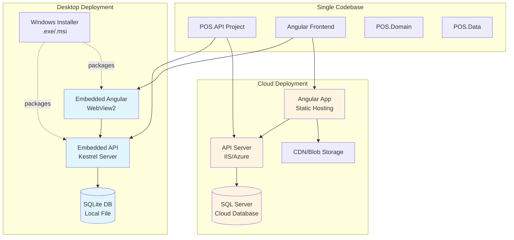

# Dual-Deployment Architecture Implementation Plan
## SQLite Desktop Application + SQL Server Cloud Deployment

---

## Executive Summary

This plan outlines the implementation strategy for supporting **two deployment models** from a **single codebase**:

1. **Desktop Application** (SQLite): Installable Windows application with embedded database, single-tenant mode
2. **Cloud Deployment** (SQL Server): Separate API and Angular deployments, full multi-tenant support

### Key Advantages
- ✅ **Single Codebase**: Maintain one source for both versions
- ✅ **Configuration-Based**: Switch between modes via configuration
- ✅ **Existing Infrastructure**: Database provider switching already implemented
- ✅ **Flexible Licensing**: Offer both on-premise and SaaS models

---

## Current State Analysis

### Existing Infrastructure ✅

The application **already supports** database provider switching:

**[appsettings.json](file:///f:/MIllyass/pos-with-inventory-management/SourceCode/SQLAPI/POS.API/appsettings.json#L2)**:
```json
{
  "DatabaseProvider": "Sqlite",
  "ConnectionStrings": {
    "DbConnectionString": "...",  // SQL Server
    "SqliteConnectionString": "Data Source=POSDb.db"  // SQLite
  }
}
```

**[Startup.cs](file:///f:/MIllyass/pos-with-inventory-management/SourceCode/SQLAPI/POS.API/Startup.cs#L71-L80)**:
```csharp
var provider = "Sqlite"; // Configuration.GetValue<string>("DatabaseProvider");
if (provider == "Sqlite")
{
    options.UseSqlite(Configuration.GetConnectionString("SqliteConnectionString"));
}
else
{
    options.UseSqlServer(Configuration.GetConnectionString("DbConnectionString"));
}
```

> [!NOTE]
> The database provider switching is **hardcoded** to "Sqlite". This needs to be changed to read from configuration.

---

## Architecture Overview



---

## Deployment Models Comparison

| Feature | Desktop (SQLite) | Cloud (SQL Server) |
|---------|------------------|-------------------|
| **Database** | SQLite (local file) | SQL Server (cloud) |
| **Multi-Tenancy** | Single tenant (optional) | Full multi-tenant |
| **API Hosting** | Embedded Kestrel | IIS/Azure App Service |
| **Frontend Hosting** | Embedded WebView2 | Separate static hosting |
| **Installation** | Windows Installer (.exe/.msi) | Web deployment |
| **Updates** | Auto-update mechanism | Continuous deployment |
| **Licensing** | Per-installation | Subscription-based |
| **Offline Support** | ✅ Full offline | ❌ Requires internet |
| **Data Location** | Local machine | Cloud server |
| **Backup** | Local file backup | Cloud backup/replication |

---

## Implementation Plan

### Phase 1: Configuration Infrastructure

#### 1.1 Create Deployment Profiles

Create environment-specific configuration files:

**[NEW] appsettings.Desktop.json**
```json
{
  "DeploymentMode": "Desktop",
  "DatabaseProvider": "Sqlite",
  "ConnectionStrings": {
    "SqliteConnectionString": "Data Source=POSDb.db"
  },
  "MultiTenancy": {
    "Enabled": false,
    "Mode": "SingleTenant"
  },
  "Kestrel": {
    "Endpoints": {
      "Http": {
        "Url": "http://localhost:5000"
      }
    }
  },
  "DesktopSettings": {
    "EnableAutoUpdate": true,
    "UpdateCheckUrl": "https://updates.yourcompany.com/desktop/version.json",
    "DataDirectory": "%APPDATA%\\YourCompany\\POS\\Data",
    "EnableOfflineMode": true
  }
}
```

**[NEW] appsettings.Cloud.json**
```json
{
  "DeploymentMode": "Cloud",
  "DatabaseProvider": "SqlServer",
  "ConnectionStrings": {
    "DbConnectionString": "Server=your-server.database.windows.net;Database=POSDb;User Id=admin;Password=***;TrustServerCertificate=True;"
  },
  "MultiTenancy": {
    "Enabled": true,
    "Mode": "MultiTenant",
    "TenantResolutionStrategy": "Subdomain"
  },
  "Kestrel": {
    "Endpoints": {
      "Http": {
        "Url": "http://*:80"
      },
      "Https": {
        "Url": "https://*:443"
      }
    }
  },
  "CloudSettings": {
    "CorsOrigins": [
      "https://app.yourcompany.com",
      "https://www.yourcompany.com"
    ],
    "EnableCdn": true,
    "CdnUrl": "https://cdn.yourcompany.com"
  }
}
```

#### 1.2 Update Startup.cs

**[MODIFY] [Startup.cs](file:///f:/MIllyass/pos-with-inventory-management/SourceCode/SQLAPI/POS.API/Startup.cs#L71)**

Change from hardcoded to configuration-based:

```csharp
// BEFORE
var provider = "Sqlite"; // Configuration.GetValue<string>("DatabaseProvider");

// AFTER
var provider = Configuration.GetValue<string>("DatabaseProvider");
var deploymentMode = Configuration.GetValue<string>("DeploymentMode");
```

#### 1.3 Create Deployment Mode Service

**[NEW] DeploymentSettings.cs**
```csharp
public class DeploymentSettings
{
    public string Mode { get; set; } // "Desktop" or "Cloud"
    public string DatabaseProvider { get; set; }
    public bool IsDesktop => Mode == "Desktop";
    public bool IsCloud => Mode == "Cloud";
    public MultiTenancySettings MultiTenancy { get; set; }
}

public class MultiTenancySettings
{
    public bool Enabled { get; set; }
    public string Mode { get; set; } // "SingleTenant" or "MultiTenant"
}
```

Register in Startup.cs:
```csharp
services.Configure<DeploymentSettings>(Configuration);
```

---

### Phase 2: Desktop Application Packaging

#### 2.1 Desktop Project Structure

Create a new desktop wrapper project:

**[NEW] POS.Desktop.csproj**
```xml
<Project Sdk="Microsoft.NET.Sdk">
  <PropertyGroup>
    <OutputType>WinExe</OutputType>
    <TargetFramework>net10.0-windows</TargetFramework>
    <UseWindowsForms>true</UseWindowsForms>
    <UseWPF>false</UseWPF>
    <ApplicationIcon>app.ico</ApplicationIcon>
  </PropertyGroup>

  <ItemGroup>
    <PackageReference Include="Microsoft.Web.WebView2" Version="1.0.2739.15" />
    <ProjectReference Include="..\POS.API\POS.API.csproj" />
  </ItemGroup>

  <ItemGroup>
    <!-- Embed Angular dist files -->
    <EmbeddedResource Include="..\..\Angular\dist\**\*" />
  </ItemGroup>
</Project>
```

#### 2.2 Desktop Main Form

**[NEW] MainForm.cs**
```csharp
public class MainForm : Form
{
    private WebView2 webView;
    private IHost apiHost;
    private const string API_URL = "http://localhost:5000";

    public MainForm()
    {
        InitializeComponent();
        InitializeWebView();
        StartApiServer();
    }

    private async void InitializeWebView()
    {
        webView = new WebView2
        {
            Dock = DockStyle.Fill
        };
        Controls.Add(webView);
        
        await webView.EnsureCoreWebView2Async();
        webView.CoreWebView2.Navigate(API_URL);
    }

    private void StartApiServer()
    {
        var builder = WebApplication.CreateBuilder(new WebApplicationOptions
        {
            EnvironmentName = "Desktop",
            ContentRootPath = AppDomain.CurrentDomain.BaseDirectory
        });

        // Configure services (same as POS.API)
        var startup = new Startup(builder.Configuration);
        startup.ConfigureServices(builder.Services);

        apiHost = builder.Build();
        
        startup.Configure((IApplicationBuilder)apiHost, 
            builder.Environment, 
            apiHost.Services.GetRequiredService<ILoggerFactory>());

        Task.Run(() => apiHost.RunAsync());
    }

    protected override void OnFormClosing(FormClosingEventArgs e)
    {
        apiHost?.StopAsync().Wait();
        base.OnFormClosing(e);
    }
}
```

#### 2.3 Desktop Installer

Use **Inno Setup** or **WiX Toolset** to create installer:

**[NEW] setup.iss** (Inno Setup Script)
```ini
[Setup]
AppName=YourCompany POS
AppVersion=1.0.0
DefaultDirName={autopf}\YourCompany\POS
DefaultGroupName=YourCompany POS
OutputDir=.\Output
OutputBaseFilename=POSSetup
Compression=lzma2
SolidCompression=yes

[Files]
Source: "bin\Release\net10.0-windows\publish\*"; DestDir: "{app}"; Flags: ignoreversion recursesubdirs

[Icons]
Name: "{group}\POS Application"; Filename: "{app}\POS.Desktop.exe"
Name: "{autodesktop}\POS Application"; Filename: "{app}\POS.Desktop.exe"

[Run]
Filename: "{app}\POS.Desktop.exe"; Description: "Launch POS Application"; Flags: nowait postinstall skipifsilent
```

#### 2.4 Desktop Build Script

**[NEW] build-desktop.ps1**
```powershell
# Build Desktop Version
param(
    [string]$Version = "1.0.0"
)

Write-Host "Building Desktop Application v$Version..." -ForegroundColor Green

# Build Angular
Set-Location "..\..\Angular"
npm run build -- --configuration production

# Build API with Desktop configuration
Set-Location "..\SQLAPI\POS.API"
dotnet publish -c Release -r win-x64 --self-contained true `
    -p:PublishSingleFile=true `
    -p:IncludeNativeLibrariesForSelfExtract=true `
    -p:EnvironmentName=Desktop

# Build Desktop Wrapper
Set-Location "..\POS.Desktop"
dotnet publish -c Release -r win-x64 --self-contained true

# Create Installer
iscc setup.iss

Write-Host "Desktop build complete! Installer: .\Output\POSSetup.exe" -ForegroundColor Green
```

---

### Phase 3: Cloud Deployment Configuration

#### 3.1 API Deployment (Azure App Service / IIS)

**[NEW] azure-deploy-api.yml** (Azure DevOps Pipeline)
```yaml
trigger:
  branches:
    include:
      - main
  paths:
    include:
      - SQLAPI/**

pool:
  vmImage: 'windows-latest'

variables:
  buildConfiguration: 'Release'
  azureSubscription: 'YourAzureSubscription'
  webAppName: 'yourcompany-pos-api'

steps:
- task: UseDotNet@2
  inputs:
    version: '10.x'

- task: DotNetCoreCLI@2
  displayName: 'Restore NuGet Packages'
  inputs:
    command: 'restore'
    projects: 'SQLAPI/POS.API/POS.API.csproj'

- task: DotNetCoreCLI@2
  displayName: 'Build API'
  inputs:
    command: 'build'
    projects: 'SQLAPI/POS.API/POS.API.csproj'
    arguments: '--configuration $(buildConfiguration)'

- task: DotNetCoreCLI@2
  displayName: 'Publish API'
  inputs:
    command: 'publish'
    publishWebProjects: false
    projects: 'SQLAPI/POS.API/POS.API.csproj'
    arguments: '--configuration $(buildConfiguration) --output $(Build.ArtifactStagingDirectory)'
    zipAfterPublish: true

- task: AzureWebApp@1
  displayName: 'Deploy to Azure App Service'
  inputs:
    azureSubscription: '$(azureSubscription)'
    appName: '$(webAppName)'
    package: '$(Build.ArtifactStagingDirectory)/**/*.zip'
    appSettings: |
      -DeploymentMode Cloud
      -DatabaseProvider SqlServer
      -ConnectionStrings:DbConnectionString "$(SQL_CONNECTION_STRING)"
```

#### 3.2 Angular Deployment (Static Hosting / CDN)

**[NEW] azure-deploy-angular.yml**
```yaml
trigger:
  branches:
    include:
      - main
  paths:
    include:
      - Angular/**

pool:
  vmImage: 'ubuntu-latest'

variables:
  storageAccount: 'yourcompanypos'
  cdnProfile: 'pos-cdn'

steps:
- task: NodeTool@0
  inputs:
    versionSpec: '18.x'

- script: |
    cd Angular
    npm install
    npm run build -- --configuration production
  displayName: 'Build Angular App'

- task: AzureCLI@2
  displayName: 'Deploy to Azure Storage'
  inputs:
    azureSubscription: '$(azureSubscription)'
    scriptType: 'bash'
    scriptLocation: 'inlineScript'
    inlineScript: |
      az storage blob upload-batch \
        --account-name $(storageAccount) \
        --destination '$web' \
        --source Angular/dist \
        --overwrite

- task: AzureCLI@2
  displayName: 'Purge CDN'
  inputs:
    azureSubscription: '$(azureSubscription)'
    scriptType: 'bash'
    scriptLocation: 'inlineScript'
    inlineScript: |
      az cdn endpoint purge \
        --profile-name $(cdnProfile) \
        --name pos-endpoint \
        --resource-group pos-rg \
        --content-paths '/*'
```

#### 3.3 CORS Configuration for Separate Hosting

**[MODIFY] Startup.cs**

Update CORS configuration to support separate Angular hosting:

```csharp
public void ConfigureServices(IServiceCollection services)
{
    var deploymentSettings = Configuration.GetSection("DeploymentSettings").Get<DeploymentSettings>();
    
    services.AddCors(options =>
    {
        if (deploymentSettings.IsCloud)
        {
            // Cloud: Allow specific origins
            var allowedOrigins = Configuration.GetSection("CloudSettings:CorsOrigins")
                .Get<string[]>();
            
            options.AddPolicy("CloudCorsPolicy", builder =>
            {
                builder.WithOrigins(allowedOrigins)
                    .AllowAnyHeader()
                    .AllowAnyMethod()
                    .AllowCredentials()
                    .WithExposedHeaders("X-Pagination", "X-Tenant-ID");
            });
        }
        else
        {
            // Desktop: Allow localhost
            options.AddPolicy("DesktopCorsPolicy", builder =>
            {
                builder.WithOrigins("http://localhost:5000", "http://localhost:4200")
                    .AllowAnyHeader()
                    .AllowAnyMethod()
                    .AllowCredentials();
            });
        }
    });
}

public void Configure(IApplicationBuilder app, IWebHostEnvironment env)
{
    var deploymentSettings = Configuration.GetSection("DeploymentSettings").Get<DeploymentSettings>();
    
    if (deploymentSettings.IsCloud)
    {
        app.UseCors("CloudCorsPolicy");
    }
    else
    {
        app.UseCors("DesktopCorsPolicy");
    }
    
    // ... rest of middleware
}
```

#### 3.4 Angular Environment Configuration

**[MODIFY] Angular/src/environments/environment.prod.ts**
```typescript
export const environment = {
  production: true,
  apiUrl: 'https://api.yourcompany.com', // Cloud API
  deploymentMode: 'cloud'
};
```

**[NEW] Angular/src/environments/environment.desktop.ts**
```typescript
export const environment = {
  production: true,
  apiUrl: 'http://localhost:5000', // Embedded API
  deploymentMode: 'desktop'
};
```

**Update Angular build configurations** in `angular.json`:
```json
{
  "configurations": {
    "production": {
      "fileReplacements": [{
        "replace": "src/environments/environment.ts",
        "with": "src/environments/environment.prod.ts"
      }]
    },
    "desktop": {
      "fileReplacements": [{
        "replace": "src/environments/environment.ts",
        "with": "src/environments/environment.desktop.ts"
      }]
    }
  }
}
```

---

### Phase 4: Multi-Tenancy Mode Switching

#### 4.1 Conditional Multi-Tenancy

**[MODIFY] Startup.cs**

Make multi-tenancy conditional based on deployment mode:

```csharp
public void ConfigureServices(IServiceCollection services)
{
    var deploymentSettings = Configuration.GetSection("DeploymentSettings").Get<DeploymentSettings>();
    
    // Register tenant provider only in cloud mode
    if (deploymentSettings.MultiTenancy.Enabled)
    {
        services.AddScoped<ITenantProvider, TenantProvider>();
    }
    else
    {
        // Desktop: Use single-tenant provider
        services.AddScoped<ITenantProvider, SingleTenantProvider>();
    }
    
    // ... rest of configuration
}

public void Configure(IApplicationBuilder app, IWebHostEnvironment env)
{
    var deploymentSettings = Configuration.GetSection("DeploymentSettings").Get<DeploymentSettings>();
    
    // Add tenant resolution middleware only in cloud mode
    if (deploymentSettings.MultiTenancy.Enabled)
    {
        app.UseMiddleware<TenantResolutionMiddleware>();
    }
    
    // ... rest of middleware
}
```

#### 4.2 Single-Tenant Provider

**[NEW] SingleTenantProvider.cs**
```csharp
public class SingleTenantProvider : ITenantProvider
{
    private static readonly Guid DefaultTenantId = Guid.Parse("00000000-0000-0000-0000-000000000001");
    
    public Guid? GetTenantId()
    {
        return DefaultTenantId;
    }

    public void SetTenantId(Guid tenantId)
    {
        // No-op for single tenant
    }

    public Task<Tenant> GetCurrentTenantAsync()
    {
        return Task.FromResult(new Tenant
        {
            Id = DefaultTenantId,
            Name = "Default Tenant",
            IsActive = true
        });
    }
}
```

---

### Phase 5: Build Automation

#### 5.1 Master Build Script

**[NEW] build-all.ps1**
```powershell
param(
    [ValidateSet("Desktop", "Cloud", "Both")]
    [string]$Target = "Both",
    [string]$Version = "1.0.0"
)

function Build-Desktop {
    Write-Host "Building Desktop Version..." -ForegroundColor Cyan
    .\build-desktop.ps1 -Version $Version
}

function Build-Cloud {
    Write-Host "Building Cloud Version..." -ForegroundColor Cyan
    
    # Build API
    Set-Location "SQLAPI\POS.API"
    dotnet publish -c Release -o "..\..\publish\cloud\api"
    
    # Build Angular
    Set-Location "..\..\Angular"
    npm run build -- --configuration production
    
    Write-Host "Cloud build complete!" -ForegroundColor Green
}

switch ($Target) {
    "Desktop" { Build-Desktop }
    "Cloud" { Build-Cloud }
    "Both" {
        Build-Desktop
        Build-Cloud
    }
}
```

---

## Database Migration Strategy

### Desktop (SQLite)

**Automatic Migrations on Startup**:
```csharp
// In Desktop Main Form or Startup
using (var scope = apiHost.Services.CreateScope())
{
    var context = scope.ServiceProvider.GetRequiredService<POSDbContext>();
    context.Database.Migrate(); // Auto-apply migrations
}
```

### Cloud (SQL Server)

**Manual Migration via CI/CD**:
```yaml
- task: DotNetCoreCLI@2
  displayName: 'Apply EF Migrations'
  inputs:
    command: 'custom'
    custom: 'ef'
    arguments: 'database update --project POS.Domain --startup-project POS.API'
  env:
    ConnectionStrings__DbConnectionString: $(SQL_CONNECTION_STRING)
```

---

## Testing Strategy

### Desktop Testing Checklist
- [ ] Install on clean Windows machine
- [ ] Verify SQLite database creation
- [ ] Test offline functionality
- [ ] Verify auto-update mechanism
- [ ] Test uninstall process
- [ ] Performance testing with local database

### Cloud Testing Checklist
- [ ] Deploy to staging environment
- [ ] Test multi-tenant isolation
- [ ] Verify CORS with separate Angular hosting
- [ ] Load testing with SQL Server
- [ ] Test CDN delivery
- [ ] Verify SSL/HTTPS configuration

---

## Deployment Checklist

### Desktop Deployment
- [ ] Build desktop version with `build-desktop.ps1`
- [ ] Test installer on multiple Windows versions
- [ ] Code sign the executable
- [ ] Upload to distribution server
- [ ] Update auto-update manifest
- [ ] Publish release notes

### Cloud Deployment
- [ ] Configure Azure resources (App Service, SQL Server, Storage)
- [ ] Set up CI/CD pipelines
- [ ] Configure environment variables
- [ ] Apply database migrations
- [ ] Deploy API to App Service
- [ ] Deploy Angular to static hosting
- [ ] Configure CDN
- [ ] Test end-to-end functionality
- [ ] Enable monitoring and logging

---

## Security Considerations

### Desktop
- ✅ Local SQLite database (encrypted recommended)
- ✅ No internet exposure
- ⚠️ Protect against local file access
- ⚠️ Implement license validation

### Cloud
- ✅ HTTPS only
- ✅ SQL Server with firewall rules
- ✅ Tenant isolation via query filters
- ✅ CORS configured for specific origins
- ✅ API authentication required
- ⚠️ Implement rate limiting
- ⚠️ Enable DDoS protection

---

## Cost Comparison

| Component | Desktop | Cloud (Monthly) |
|-----------|---------|-----------------|
| **Infrastructure** | $0 (customer's hardware) | $50-500 (Azure/AWS) |
| **Database** | $0 (SQLite) | $50-200 (SQL Server) |
| **Hosting** | $0 | $20-100 (App Service + CDN) |
| **Maintenance** | Low (auto-update) | Medium (monitoring, updates) |
| **Scaling** | Per-installation | Automatic |

---

## Licensing Strategy

### Desktop License
- **Model**: Perpetual license per installation
- **Pricing**: One-time fee + optional maintenance
- **Validation**: License key validation on startup
- **Updates**: Included with maintenance

### Cloud License
- **Model**: Subscription per tenant
- **Pricing**: Monthly/annual per tenant
- **Tiers**: Basic, Professional, Enterprise
- **Billing**: Automated via subscription service

---

## Next Steps

1. **Immediate** (Week 1):
   - [ ] Uncomment database provider configuration reading
   - [ ] Create deployment-specific appsettings files
   - [ ] Test database provider switching

2. **Short-term** (Weeks 2-3):
   - [ ] Create desktop wrapper project
   - [ ] Implement single-tenant provider
   - [ ] Build desktop installer

3. **Medium-term** (Weeks 4-6):
   - [ ] Set up Azure infrastructure
   - [ ] Configure CI/CD pipelines
   - [ ] Deploy to staging environment

4. **Long-term** (Weeks 7-8):
   - [ ] Production deployment
   - [ ] User acceptance testing
   - [ ] Documentation and training

---

## Conclusion

This dual-deployment architecture provides maximum flexibility while maintaining a single codebase. The configuration-based approach allows seamless switching between desktop and cloud modes, making it easy to support both deployment models with minimal code duplication.

**Key Success Factors**:
- ✅ Leverage existing database provider switching
- ✅ Use configuration to control deployment mode
- ✅ Conditional service registration based on mode
- ✅ Separate build scripts for each target
- ✅ Automated testing for both scenarios
