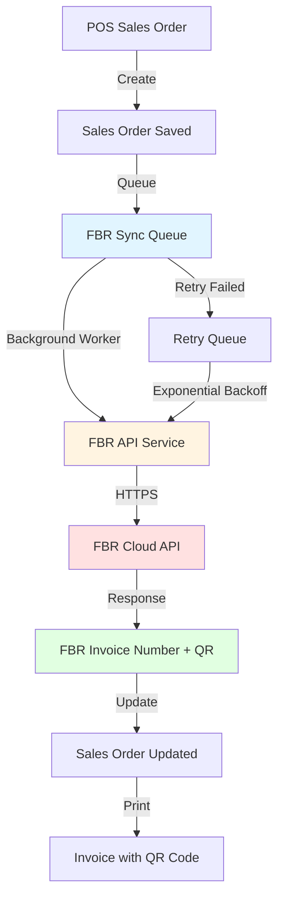

# FBR POS Integration - Direct API Implementation Plan
## Sales Invoice Integration with Pakistan Federal Board of Revenue (Without SDC)

---

## Executive Summary

This plan outlines a **direct API integration** with FBR (Federal Board of Revenue) for real-time sales invoice reporting, **eliminating the need for Software Data Controller (SDC)**. The implementation uses a **background worker service** for asynchronous invoice synchronization, ensuring reliable FBR compliance without blocking the sales process.

**Key Design Decisions:**
- ✅ **Direct FBR API Integration** - No SDC middleware required
- ✅ **Async Background Worker** - Non-blocking invoice submission
- ✅ **Retry Queue System** - Automatic retry for failed submissions
- ✅ **QR Code Integration** - Embedded in invoice reports
- ✅ **Offline-First Design** - Sales continue even if FBR is down

---

## Architecture Overview



### Key Components

1. **Sales Order Creation** - Normal POS flow, no blocking
2. **FBR Sync Queue** - In-memory or database queue for pending invoices
3. **Background Worker Service** - Processes queue asynchronously
4. **FBR API Service** - Direct communication with FBR
5. **Retry Mechanism** - Handles failures with exponential backoff
6. **Invoice Report** - Updated with QR code and FBR details

---

## Deep Analysis: SalesInvoice ↔ FBR Invoice Integration

### Current SalesOrder Flow

```csharp
// Current flow (simplified)
1. User creates sale in POS
2. SalesOrder entity created
3. Payment processed
4. Invoice printed
5. Transaction complete
```

### New FBR-Integrated Flow

```csharp
// New flow with FBR integration
1. User creates sale in POS
2. SalesOrder entity created
3. Payment processed
4. FBRInvoice record created (Status: Pending)
5. Invoice queued for FBR submission
6. Invoice printed (with "FBR Pending" status)
7. Background worker submits to FBR
8. FBR responds with invoice number + QR
9. SalesOrder updated with FBR details
10. Reprint option available with FBR QR code
```

### Critical Design Considerations

#### 1. **Non-Blocking Sales Process**
> [!IMPORTANT]
> **Sales MUST NOT be blocked by FBR submission**
> - FBR API may be slow (2-5 seconds per invoice)
> - Network issues can cause delays
> - FBR server downtime should not stop sales
> 
> **Solution**: Async background processing

#### 2. **Data Integrity**
> [!CAUTION]
> **Every sale MUST eventually get FBR number**
> - Track submission status rigorously
> - Implement comprehensive retry logic
> - Alert on persistent failures
> - Manual intervention for edge cases

#### 3. **Invoice Numbering**
> [!WARNING]
> **Two invoice numbers to manage**
> - **Internal Invoice Number**: Your POS system (INV-2026-0001)
> - **FBR Invoice Number**: Assigned by FBR (FBR-2026-123456789)
> 
> Both must be displayed on invoice and tracked in database.

---

## Proposed Changes

### Component 1: Database Schema Extensions

#### [MODIFY] [SalesOrder.cs](file:///f:/MIllyass/pos-with-inventory-management/SourceCode/SQLAPI/POS.Data/Entities/SalesOrder.cs)

```csharp
public class SalesOrder : BaseEntity
{
    // ... existing properties ...
    
    // FBR-Specific Fields
    public string BuyerNTN { get; set; } // National Tax Number (optional for retail)
    public string BuyerCNIC { get; set; } // CNIC for individuals
    public string BuyerName { get; set; } // Required for FBR
    public string BuyerPhoneNumber { get; set; } // Required
    public string BuyerAddress { get; set; }
    public string SaleType { get; set; } // "Retail", "Wholesale", "Export"
    
    // FBR Submission Status
    public FBRSubmissionStatus FBRStatus { get; set; } = FBRSubmissionStatus.NotSubmitted;
    public string FBRInvoiceNumber { get; set; } // FBR-assigned number
    public string FBRUSIN { get; set; } // Unique Sales Invoice Number from FBR
    public DateTime? FBRSubmittedAt { get; set; }
    public DateTime? FBRAcknowledgedAt { get; set; }
    public string FBRQRCodeData { get; set; } // QR code content
    public string FBRQRCodeImagePath { get; set; } // Path to QR image file
    public int FBRRetryCount { get; set; } = 0;
    public DateTime? FBRNextRetryAt { get; set; }
    public string FBRErrorMessage { get; set; }
    public string FBRResponseJson { get; set; } // Full FBR response for audit
    
    // Navigation
    public virtual ICollection<FBRSubmissionLog> FBRSubmissionLogs { get; set; }
}

public enum FBRSubmissionStatus
{
    NotSubmitted = 0,      // Initial state
    Queued = 1,            // Added to sync queue
    Submitting = 2,        // Currently being submitted
    Submitted = 3,         // Successfully submitted to FBR
    Acknowledged = 4,      // FBR confirmed receipt
    Failed = 5,            // Submission failed
    RequiresManualReview = 6, // Too many failures, needs manual intervention
    Cancelled = 7          // Invoice cancelled/voided
}
```

#### [NEW] [FBRSubmissionLog.cs](file:///f:/MIllyass/pos-with-inventory-management/SourceCode/SQLAPI/POS.Data/Entities/FBR/FBRSubmissionLog.cs)

```csharp
/// <summary>
/// Audit log for all FBR submission attempts
/// </summary>
public class FBRSubmissionLog : BaseEntity
{
    public Guid SalesOrderId { get; set; }
    public DateTime AttemptedAt { get; set; }
    public FBRSubmissionStatus Status { get; set; }
    public string RequestPayload { get; set; } // JSON sent to FBR
    public string ResponsePayload { get; set; } // JSON received from FBR
    public int HttpStatusCode { get; set; }
    public string ErrorMessage { get; set; }
    public TimeSpan ResponseTime { get; set; }
    public string SubmittedBy { get; set; } // "BackgroundWorker" or "Manual"
    
    // Navigation
    public virtual SalesOrder SalesOrder { get; set; }
}
```

#### [NEW] [FBRConfiguration.cs](file:///f:/MIllyass/pos-with-inventory-management/SourceCode/SQLAPI/POS.Data/Entities/FBR/FBRConfiguration.cs)

```csharp
/// <summary>
/// FBR API configuration per tenant
/// </summary>
public class FBRConfiguration : BaseEntity
{
    public Guid TenantId { get; set; }
    
    // FBR Credentials (Encrypted in database)
    public string ClientId { get; set; }
    public string ClientSecret { get; set; } // Encrypted
    public string FBRKey { get; set; } // Encrypted
    public string POSID { get; set; } // POS Machine ID
    public string BranchCode { get; set; }
    public string STRN { get; set; } // Sales Tax Registration Number
    
    // API Configuration
    public string ApiBaseUrl { get; set; } // Sandbox or Production
    public bool IsEnabled { get; set; } = false;
    public bool IsTestMode { get; set; } = true; // Sandbox vs Production
    public bool AutoSubmitInvoices { get; set; } = true;
    
    // Token Management
    public string CurrentAccessToken { get; set; } // Encrypted
    public DateTime? TokenExpiresAt { get; set; }
    public DateTime? LastTokenRefresh { get; set; }
    
    // Retry Configuration
    public int MaxRetryAttempts { get; set; } = 5;
    public int RetryDelaySeconds { get; set; } = 60; // Initial delay
    public int MaxRetryDelaySeconds { get; set; } = 3600; // Max 1 hour
    
    // Monitoring
    public DateTime? LastSuccessfulSubmission { get; set; }
    public int TotalSubmissionsToday { get; set; }
    public int FailedSubmissionsToday { get; set; }
}
```

---

### Component 2: Background Worker Service

#### [NEW] [FBRSyncBackgroundService.cs](file:///f:/MIllyass/pos-with-inventory-management/SourceCode/SQLAPI/POS.API/BackgroundServices/FBRSyncBackgroundService.cs)

```csharp
/// <summary>
/// Background service that continuously processes FBR invoice submission queue
/// </summary>
public class FBRSyncBackgroundService : BackgroundService
{
    private readonly IServiceProvider _serviceProvider;
    private readonly ILogger<FBRSyncBackgroundService> _logger;
    private readonly TimeSpan _processingInterval = TimeSpan.FromSeconds(30);
    
    public FBRSyncBackgroundService(
        IServiceProvider serviceProvider,
        ILogger<FBRSyncBackgroundService> logger)
    {
        _serviceProvider = serviceProvider;
        _logger = logger;
    }
    
    protected override async Task ExecuteAsync(CancellationToken stoppingToken)
    {
        _logger.LogInformation("FBR Sync Background Service started");
        
        while (!stoppingToken.IsCancellationRequested)
        {
            try
            {
                await ProcessPendingInvoicesAsync(stoppingToken);
                await ProcessRetryQueueAsync(stoppingToken);
            }
            catch (Exception ex)
            {
                _logger.LogError(ex, "Error in FBR Sync Background Service");
            }
            
            await Task.Delay(_processingInterval, stoppingToken);
        }
        
        _logger.LogInformation("FBR Sync Background Service stopped");
    }
    
    private async Task ProcessPendingInvoicesAsync(CancellationToken cancellationToken)
    {
        using var scope = _serviceProvider.CreateScope();
        var context = scope.ServiceProvider.GetRequiredService<POSDbContext>();
        var fbrService = scope.ServiceProvider.GetRequiredService<IFBRInvoiceService>();
        
        // Get invoices that need FBR submission
        var pendingInvoices = await context.SalesOrders
            .Where(so => so.FBRStatus == FBRSubmissionStatus.NotSubmitted 
                      || so.FBRStatus == FBRSubmissionStatus.Queued)
            .Where(so => so.FBRRetryCount < 5) // Max retry limit
            .OrderBy(so => so.CreatedDate)
            .Take(10) // Process 10 at a time
            .ToListAsync(cancellationToken);
        
        foreach (var invoice in pendingInvoices)
        {
            if (cancellationToken.IsCancellationRequested)
                break;
                
            await SubmitInvoiceToFBRAsync(invoice, fbrService, context);
        }
    }
    
    private async Task ProcessRetryQueueAsync(CancellationToken cancellationToken)
    {
        using var scope = _serviceProvider.CreateScope();
        var context = scope.ServiceProvider.GetRequiredService<POSDbContext>();
        var fbrService = scope.ServiceProvider.GetRequiredService<IFBRInvoiceService>();
        
        // Get failed invoices ready for retry
        var now = DateTime.UtcNow;
        var retryInvoices = await context.SalesOrders
            .Where(so => so.FBRStatus == FBRSubmissionStatus.Failed)
            .Where(so => so.FBRNextRetryAt <= now)
            .Where(so => so.FBRRetryCount < 5)
            .OrderBy(so => so.FBRNextRetryAt)
            .Take(5) // Process 5 retries at a time
            .ToListAsync(cancellationToken);
        
        foreach (var invoice in retryInvoices)
        {
            if (cancellationToken.IsCancellationRequested)
                break;
                
            await SubmitInvoiceToFBRAsync(invoice, fbrService, context);
        }
    }
    
    private async Task SubmitInvoiceToFBRAsync(
        SalesOrder salesOrder, 
        IFBRInvoiceService fbrService, 
        POSDbContext context)
    {
        try
        {
            _logger.LogInformation(
                "Submitting invoice {InvoiceId} to FBR (Attempt {Attempt})", 
                salesOrder.Id, 
                salesOrder.FBRRetryCount + 1);
            
            // Update status to Submitting
            salesOrder.FBRStatus = FBRSubmissionStatus.Submitting;
            await context.SaveChangesAsync();
            
            // Submit to FBR
            var response = await fbrService.SubmitInvoiceAsync(salesOrder);
            
            // Update with FBR response
            salesOrder.FBRStatus = FBRSubmissionStatus.Acknowledged;
            salesOrder.FBRInvoiceNumber = response.InvoiceNumber;
            salesOrder.FBRUSIN = response.USIN;
            salesOrder.FBRQRCodeData = response.QRCodeData;
            salesOrder.FBRAcknowledgedAt = DateTime.UtcNow;
            salesOrder.FBRResponseJson = JsonSerializer.Serialize(response);
            
            // Generate and save QR code image
            var qrCodePath = await GenerateQRCodeImageAsync(response.QRCodeData, salesOrder.Id);
            salesOrder.FBRQRCodeImagePath = qrCodePath;
            
            await context.SaveChangesAsync();
            
            _logger.LogInformation(
                "Successfully submitted invoice {InvoiceId} to FBR. FBR Number: {FBRNumber}", 
                salesOrder.Id, 
                response.InvoiceNumber);
        }
        catch (Exception ex)
        {
            _logger.LogError(ex, "Failed to submit invoice {InvoiceId} to FBR", salesOrder.Id);
            
            // Update failure status
            salesOrder.FBRStatus = FBRSubmissionStatus.Failed;
            salesOrder.FBRRetryCount++;
            salesOrder.FBRErrorMessage = ex.Message;
            
            // Calculate next retry time with exponential backoff
            var delaySeconds = Math.Min(
                60 * Math.Pow(2, salesOrder.FBRRetryCount), // Exponential: 60, 120, 240, 480, 960
                3600 // Max 1 hour
            );
            salesOrder.FBRNextRetryAt = DateTime.UtcNow.AddSeconds(delaySeconds);
            
            // If max retries reached, require manual review
            if (salesOrder.FBRRetryCount >= 5)
            {
                salesOrder.FBRStatus = FBRSubmissionStatus.RequiresManualReview;
                _logger.LogWarning(
                    "Invoice {InvoiceId} requires manual review after {Attempts} failed attempts", 
                    salesOrder.Id, 
                    salesOrder.FBRRetryCount);
            }
            
            await context.SaveChangesAsync();
        }
    }
    
    private async Task<string> GenerateQRCodeImageAsync(string qrData, Guid invoiceId)
    {
        // QR code generation logic
        // Save to wwwroot/qrcodes/{invoiceId}.png
        // Return relative path
        return $"/qrcodes/{invoiceId}.png";
    }
}
```

#### Registration in Startup.cs

```csharp
// In ConfigureServices
services.AddHostedService<FBRSyncBackgroundService>();
```

---

### Component 3: FBR API Service Layer

#### [NEW] [IFBRInvoiceService.cs](file:///f:/MIllyass/pos-with-inventory-management/SourceCode/SQLAPI/POS.Domain/FBR/IFBRInvoiceService.cs)

```csharp
public interface IFBRInvoiceService
{
    /// <summary>
    /// Submit invoice to FBR API
    /// </summary>
    Task<FBRInvoiceResponse> SubmitInvoiceAsync(SalesOrder salesOrder);
    
    /// <summary>
    /// Cancel/void an FBR invoice
    /// </summary>
    Task<FBRCancelResponse> CancelInvoiceAsync(string fbrInvoiceNumber, string reason);
    
    /// <summary>
    /// Verify invoice status with FBR
    /// </summary>
    Task<FBRVerificationResponse> VerifyInvoiceAsync(string fbrInvoiceNumber);
    
    /// <summary>
    /// Get FBR authentication token
    /// </summary>
    Task<string> GetAccessTokenAsync();
}
```

#### [NEW] [FBRInvoiceService.cs](file:///f:/MIllyass/pos-with-inventory-management/SourceCode/SQLAPI/POS.Domain/FBR/FBRInvoiceService.cs)

```csharp
public class FBRInvoiceService : IFBRInvoiceService
{
    private readonly HttpClient _httpClient;
    private readonly POSDbContext _context;
    private readonly ILogger<FBRInvoiceService> _logger;
    private readonly IFBRAuthenticationService _authService;
    
    public FBRInvoiceService(
        HttpClient httpClient,
        POSDbContext context,
        ILogger<FBRInvoiceService> logger,
        IFBRAuthenticationService authService)
    {
        _httpClient = httpClient;
        _context = context;
        _logger = logger;
        _authService = authService;
    }
    
    public async Task<FBRInvoiceResponse> SubmitInvoiceAsync(SalesOrder salesOrder)
    {
        // Get FBR configuration
        var config = await _context.FBRConfigurations
            .FirstOrDefaultAsync(c => c.IsEnabled);
            
        if (config == null)
            throw new InvalidOperationException("FBR is not configured");
        
        // Get access token
        var token = await _authService.GetAccessTokenAsync();
        
        // Build FBR invoice request
        var request = BuildFBRInvoiceRequest(salesOrder, config);
        
        // Create submission log
        var log = new FBRSubmissionLog
        {
            SalesOrderId = salesOrder.Id,
            AttemptedAt = DateTime.UtcNow,
            RequestPayload = JsonSerializer.Serialize(request),
            SubmittedBy = "BackgroundWorker"
        };
        
        var stopwatch = Stopwatch.StartNew();
        
        try
        {
            // Set authorization header
            _httpClient.DefaultRequestHeaders.Authorization = 
                new AuthenticationHeaderValue("Bearer", token);
            
            // Submit to FBR
            var response = await _httpClient.PostAsJsonAsync(
                $\"{config.ApiBaseUrl}/api/v1/invoice\",
                request);
            
            stopwatch.Stop();
            log.ResponseTime = stopwatch.Elapsed;
            log.HttpStatusCode = (int)response.StatusCode;
            
            if (response.IsSuccessStatusCode)
            {
                var fbrResponse = await response.Content
                    .ReadFromJsonAsync<FBRInvoiceResponse>();
                
                log.Status = FBRSubmissionStatus.Acknowledged;
                log.ResponsePayload = JsonSerializer.Serialize(fbrResponse);
                
                _context.FBRSubmissionLogs.Add(log);
                await _context.SaveChangesAsync();
                
                return fbrResponse;
            }
            else
            {
                var errorContent = await response.Content.ReadAsStringAsync();
                log.Status = FBRSubmissionStatus.Failed;
                log.ErrorMessage = errorContent;
                log.ResponsePayload = errorContent;
                
                _context.FBRSubmissionLogs.Add(log);
                await _context.SaveChangesAsync();
                
                throw new FBRApiException($\"FBR API returned {response.StatusCode}: {errorContent}\");
            }
        }
        catch (Exception ex)
        {
            stopwatch.Stop();
            log.ResponseTime = stopwatch.Elapsed;
            log.Status = FBRSubmissionStatus.Failed;
            log.ErrorMessage = ex.Message;
            
            _context.FBRSubmissionLogs.Add(log);
            await _context.SaveChangesAsync();
            
            throw;
        }
    }
    
    private FBRInvoiceRequest BuildFBRInvoiceRequest(SalesOrder salesOrder, FBRConfiguration config)
    {
        return new FBRInvoiceRequest
        {
            InvoiceNumber = salesOrder.OrderNumber,
            InvoiceType = \"Sale\",
            InvoiceDate = salesOrder.CreatedDate,
            POSID = config.POSID,
            BranchCode = config.BranchCode,
            BuyerNTN = salesOrder.BuyerNTN,
            BuyerName = salesOrder.BuyerName ?? salesOrder.Customer?.CustomerName,
            BuyerPhoneNumber = salesOrder.BuyerPhoneNumber ?? salesOrder.Customer?.MobileNo,
            TotalSaleValue = salesOrder.TotalAmount - salesOrder.TotalTax,
            TotalTaxCharged = salesOrder.TotalTax,
            TotalQuantity = salesOrder.SalesOrderItems.Sum(i => i.Quantity),
            PaymentMode = salesOrder.PaymentMethod,
            Items = salesOrder.SalesOrderItems.Select(item => new FBRInvoiceItem
            {
                ItemCode = item.Product.Code,
                ItemName = item.Product.Name,
                Quantity = item.Quantity,
                PCTCode = item.Product.PCTCode ?? \"00000000\", // Default if not set
                TaxRate = item.TaxValue / item.UnitPrice * 100, // Calculate tax rate
                SaleValue = item.UnitPrice * item.Quantity,
                TaxCharged = item.TaxValue * item.Quantity,
                Discount = item.Discount,
                TotalAmount = item.TotalAmount
            }).ToList()
        };
    }
}
```

---

### Component 4: Sales Order Integration

#### [MODIFY] [CreateSalesOrderCommandHandler.cs](file:///f:/MIllyass/pos-with-inventory-management/SourceCode/SQLAPI/POS.MediatR/Handlers/CommandHandlers/CreateSalesOrderCommandHandler.cs)

```csharp
public async Task<CommandResponse<Guid>> Handle(
    CreateSalesOrderCommand request, 
    CancellationToken cancellationToken)
{
    // ... existing sales order creation logic ...
    
    // Save sales order first
    await _context.SalesOrders.AddAsync(salesOrder, cancellationToken);
    await _context.SaveChangesAsync(cancellationToken);
    
    // Check if FBR is enabled
    var fbrConfig = await _context.FBRConfigurations
        .FirstOrDefaultAsync(c => c.IsEnabled, cancellationToken);
    
    if (fbrConfig != null && fbrConfig.AutoSubmitInvoices)
    {
        // Queue for FBR submission (don't wait for it)
        salesOrder.FBRStatus = FBRSubmissionStatus.Queued;
        salesOrder.BuyerName = request.BuyerName ?? \"Walk-in Customer\";
        salesOrder.BuyerPhoneNumber = request.BuyerPhoneNumber;
        salesOrder.BuyerNTN = request.BuyerNTN;
        salesOrder.SaleType = request.SaleType ?? \"Retail\";
        
        await _context.SaveChangesAsync(cancellationToken);
        
        _logger.LogInformation(
            \"Sales order {OrderId} queued for FBR submission\", 
            salesOrder.Id);
    }
    
    return new CommandResponse<Guid>
    {
        Success = true,
        Data = salesOrder.Id
    };
}
```

---

### Component 5: Invoice Report Updates

#### [MODIFY] Sales Invoice Report Template

**Key Changes:**
1. Add FBR Invoice Number prominently
2. Embed QR Code image
3. Add verification instructions
4. Show FBR submission status

**Updated Invoice Layout:**

```html
<!DOCTYPE html>
<html>
<head>
    <title>Sales Invoice</title>
    <style>
        .fbr-section {
            border: 2px solid #006400;
            padding: 15px;
            margin: 20px 0;
            background-color: #f0fff0;
        }
        .fbr-number {
            font-size: 18px;
            font-weight: bold;
            color: #006400;
        }
        .qr-code {
            text-align: center;
            margin: 20px 0;
        }
        .qr-code img {
            width: 150px;
            height: 150px;
        }
        .verification-instructions {
            font-size: 12px;
            color: #666;
        }
    </style>
</head>
<body>
    <!-- Company Header -->
    <div class=\"header\">
        <h1>{{CompanyName}}</h1>
        <p>STRN: {{STRN}}</p>
    </div>
    
    <!-- FBR Section -->
    <div class=\"fbr-section\">
        <div class=\"fbr-number\">
            FBR Invoice Number: {{FBRInvoiceNumber}}
        </div>
        <div>USIN: {{FBRUSIN}}</div>
        <div>Status: {{FBRStatus}}</div>
    </div>
    
    <!-- Invoice Details -->
    <div class=\"invoice-details\">
        <p>Internal Invoice: {{InvoiceNumber}}</p>
        <p>Date: {{InvoiceDate}}</p>
        <p>Customer: {{CustomerName}}</p>
    </div>
    
    <!-- Items Table -->
    <table>
        <!-- ... items ... -->
    </table>
    
    <!-- Totals -->
    <div class=\"totals\">
        <p>Subtotal: {{Subtotal}}</p>
        <p>Tax ({{TaxRate}}%): {{TaxAmount}}</p>
        <p><strong>Total: {{GrandTotal}}</strong></p>
    </div>
    
    <!-- QR Code Section -->
    <div class=\"qr-code\">
        
        <div class=\"verification-instructions\">
            <p><strong>Verify this invoice:</strong></p>
            <p>1. Scan QR code with FBR mobile app</p>
            <p>2. SMS \"VERIFY {{FBRInvoiceNumber}}\" to 9966</p>
            <p>3. WhatsApp: Scan QR code</p>
        </div>
    </div>
    
    <!-- Footer -->
    <div class=\"footer\">
        <p>Thank you for your business!</p>
        <p style=\"font-size: 10px;\">
            This is a computer-generated invoice verified by FBR
        </p>
    </div>
</body>
</html>
```

#### [NEW] Invoice Report Controller Endpoint

```csharp
[HttpGet(\"{id}/report\")]
public async Task<IActionResult> GetInvoiceReport(Guid id)
{
    var salesOrder = await _context.SalesOrders
        .Include(so => so.Customer)
        .Include(so => so.SalesOrderItems)
            .ThenInclude(soi => soi.Product)
        .FirstOrDefaultAsync(so => so.Id == id);
    
    if (salesOrder == null)
        return NotFound();
    
    var model = new InvoiceReportViewModel
    {
        InvoiceNumber = salesOrder.OrderNumber,
        FBRInvoiceNumber = salesOrder.FBRInvoiceNumber ?? \"Pending\",
        FBRUSIN = salesOrder.FBRUSIN,
        FBRStatus = salesOrder.FBRStatus.ToString(),
        QRCodeImagePath = salesOrder.FBRQRCodeImagePath ?? \"/images/qr-pending.png\",
        // ... other properties ...
    };
    
    return View(\"InvoiceReport\", model);
}
```

---

### Component 6: Manual FBR Operations

#### [NEW] FBR Management Controller

```csharp
[ApiController]
[Route(\"api/fbr\")]
public class FBRController : ControllerBase
{
    private readonly IFBRInvoiceService _fbrService;
    private readonly POSDbContext _context;
    
    /// <summary>
    /// Manually submit invoice to FBR
    /// </summary>
    [HttpPost(\"submit/{salesOrderId}\")]
    public async Task<IActionResult> SubmitInvoice(Guid salesOrderId)
    {
        var salesOrder = await _context.SalesOrders.FindAsync(salesOrderId);
        if (salesOrder == null)
            return NotFound();
        
        try
        {
            var response = await _fbrService.SubmitInvoiceAsync(salesOrder);
            return Ok(response);
        }
        catch (Exception ex)
        {
            return BadRequest(new { error = ex.Message });
        }
    }
    
    /// <summary>
    /// Get FBR submission status for invoice
    /// </summary>
    [HttpGet(\"status/{salesOrderId}\")]
    public async Task<IActionResult> GetStatus(Guid salesOrderId)
    {
        var salesOrder = await _context.SalesOrders.FindAsync(salesOrderId);
        if (salesOrder == null)
            return NotFound();
        
        return Ok(new
        {
            fbrStatus = salesOrder.FBRStatus.ToString(),
            fbrInvoiceNumber = salesOrder.FBRInvoiceNumber,
            fbrUSIN = salesOrder.FBRUSIN,
            submittedAt = salesOrder.FBRSubmittedAt,
            acknowledgedAt = salesOrder.FBRAcknowledgedAt,
            retryCount = salesOrder.FBRRetryCount,
            errorMessage = salesOrder.FBRErrorMessage
        });
    }
    
    /// <summary>
    /// Get all invoices requiring manual review
    /// </summary>
    [HttpGet(\"manual-review\")]
    public async Task<IActionResult> GetManualReviewQueue()
    {
        var invoices = await _context.SalesOrders
            .Where(so => so.FBRStatus == FBRSubmissionStatus.RequiresManualReview)
            .OrderBy(so => so.CreatedDate)
            .Select(so => new
            {
                so.Id,
                so.OrderNumber,
                so.CreatedDate,
                so.FBRRetryCount,
                so.FBRErrorMessage
            })
            .ToListAsync();
        
        return Ok(invoices);
    }
    
    /// <summary>
    /// Retry failed invoice submission
    /// </summary>
    [HttpPost(\"retry/{salesOrderId}\")]
    public async Task<IActionResult> RetrySubmission(Guid salesOrderId)
    {
        var salesOrder = await _context.SalesOrders.FindAsync(salesOrderId);
        if (salesOrder == null)
            return NotFound();
        
        // Reset retry counter and queue for submission
        salesOrder.FBRStatus = FBRSubmissionStatus.Queued;
        salesOrder.FBRRetryCount = 0;
        salesOrder.FBRNextRetryAt = null;
        salesOrder.FBRErrorMessage = null;
        
        await _context.SaveChangesAsync();
        
        return Ok(new { message = \"Invoice queued for retry\" });
    }
}
```

---

### Component 7: FBR Configuration UI (Angular)

#### [NEW] FBR Settings Component

**File:** `Angular/src/app/fbr-settings/fbr-settings.component.ts`

```typescript
export class FBRSettingsComponent implements OnInit {
  settingsForm: FormGroup;
  isTestMode = true;
  
  ngOnInit() {
    this.settingsForm = this.fb.group({
      clientId: ['', Validators.required],
      clientSecret: ['', Validators.required],
      fbrKey: ['', Validators.required],
      posId: ['', Validators.required],
      branchCode: ['', Validators.required],
      strn: ['', Validators.required],
      isEnabled: [false],
      isTestMode: [true],
      autoSubmitInvoices: [true],
      maxRetryAttempts: [5],
      retryDelaySeconds: [60]
    });
    
    this.loadSettings();
  }
  
  async testConnection() {
    // Test FBR API connection
  }
  
  async saveSettings() {
    // Save FBR configuration
  }
}
```

---

## Implementation Timeline

| Phase | Duration | Tasks |
|-------|----------|-------|
| **Phase 1: Database** | 3 days | Schema changes, migrations, seed data |
| **Phase 2: FBR API Service** | 1 week | Authentication, invoice submission, error handling |
| **Phase 3: Background Worker** | 1 week | Queue processing, retry logic, monitoring |
| **Phase 4: Sales Integration** | 3 days | Update sales order creation, add FBR fields |
| **Phase 5: Invoice Report** | 1 week | QR code generation, report template updates |
| **Phase 6: Configuration UI** | 1 week | Settings page, manual operations, monitoring |
| **Phase 7: Testing** | 2 weeks | Unit tests, integration tests, FBR sandbox |
| **Phase 8: Production** | 1 week | FBR approval, go-live, monitoring |

**Total: 7-8 weeks**

---

## Testing Strategy

### 1. Unit Tests
- FBR API service methods
- Invoice data transformation
- QR code generation
- Retry logic calculations

### 2. Integration Tests (Sandbox)
- End-to-end invoice submission
- Token refresh mechanism
- Error handling scenarios
- Retry queue processing

### 3. Load Testing
- Background worker performance
- Concurrent invoice submissions
- Queue processing under load

### 4. Manual Testing
- FBR sandbox environment
- QR code verification
- Invoice report printing
- Manual retry operations

---

## Monitoring & Alerts

### Key Metrics to Track

1. **Submission Success Rate**
   - Target: > 99%
   - Alert if < 95%

2. **Average Submission Time**
   - Target: < 5 seconds
   - Alert if > 10 seconds

3. **Queue Size**
   - Target: < 10 pending
   - Alert if > 50 pending

4. **Failed Submissions**
   - Alert if > 5 failures in 1 hour
   - Alert for any invoice requiring manual review

5. **Token Expiry**
   - Alert 1 hour before token expires
   - Auto-refresh 30 minutes before expiry

### Dashboard Metrics

```csharp
public class FBRDashboardMetrics
{
    public int TotalInvoicesToday { get; set; }
    public int SuccessfulSubmissions { get; set; }
    public int FailedSubmissions { get; set; }
    public int PendingSubmissions { get; set; }
    public int ManualReviewRequired { get; set; }
    public decimal SuccessRate { get; set; }
    public TimeSpan AverageSubmissionTime { get; set; }
    public DateTime? LastSuccessfulSubmission { get; set; }
    public DateTime? TokenExpiresAt { get; set; }
}
```

---

## Risk Mitigation

| Risk | Impact | Mitigation |
|------|--------|------------|
| FBR API downtime | High | Queue invoices, retry automatically, offline mode |
| Network failures | Medium | Exponential backoff, persistent queue |
| Token expiration | Medium | Auto-refresh 30 min before expiry |
| Invalid invoice data | Low | Pre-validation before submission |
| QR code generation failure | Low | Fallback to text-based verification |
| Background worker crash | High | Automatic restart, health checks |

---

## Success Criteria

✅ **Technical:**
- 99%+ FBR submission success rate
- < 5 second average submission time
- Automatic retry on failures
- QR codes generated for all invoices
- Background worker uptime > 99.9%

✅ **Compliance:**
- All invoices have FBR numbers
- QR codes scannable and valid
- Real-time data transmission
- Complete audit trail

✅ **Business:**
- Zero sales blocking due to FBR
- Minimal manual intervention
- Clear error reporting
- Easy troubleshooting

---

## Next Steps

1. **Review this plan** - Confirm approach and timeline
2. **FBR Registration** - Obtain credentials and sandbox access
3. **Database Migration** - Implement schema changes
4. **Prototype** - Build basic FBR submission flow
5. **Sandbox Testing** - Validate with FBR test environment
6. **Production Deployment** - Go live with monitoring

---

## Questions for Clarification

1. Do you have FBR credentials already (STRN, Client ID, etc.)?
2. Should we support offline mode (queue invoices when internet is down)?
3. What should happen if FBR submission fails - print invoice anyway?
4. Do you want email/SMS alerts for failed submissions?
5. Should there be a manual approval step before FBR submission?
