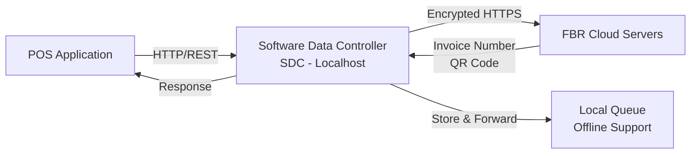

# FBR POS Integration - Implementation Plan
## Sales Invoice Integration with Pakistan Federal Board of Revenue

---

## Executive Summary

This plan outlines the implementation of FBR (Federal Board of Revenue) POS integration for real-time sales invoice reporting to comply with Pakistan tax regulations. The integration enables automatic submission of sales data, QR code generation for invoice verification, and digital fiscal invoice numbering.

**Key Compliance Requirements:**
- Real-time sales data transmission to FBR
- Unique FBR invoice numbers with QR codes
- Encrypted data transmission
- Digital signatures on invoices
- Support for returns/exchanges (debit/credit notes)

---

## FBR Software Data Controller (SDC) Architecture

> [!IMPORTANT]
> **Software Data Controller (SDC) is Mandatory**
> - FBR-provided middleware component (FBRIMS.zip)
> - Must be installed locally or within local network
> - Acts as secure bridge between POS and FBR servers

### Architecture Overview



### SDC Deployment Options

**Option 1: Desktop POS (Recommended for your setup)**
```
Desktop Machine:
├── POS Application (Port 5000)
├── SQLite Database
└── FBR SDC Service (Port 8080)
    ├── Handles encryption
    ├── Manages FBR communication
    └── Queues offline invoices
```

**Option 2: Cloud POS**
```
Cloud Server:
├── POS API (Port 5000)
├── SQL Server Database
└── FBR SDC Service (Port 8080)
```

### How SDC Works

1. **Your POS Application** creates a sales invoice
2. **Your POS** sends invoice data to **SDC** (localhost:8080/api/invoice)
3. **SDC** encrypts and formats data per FBR requirements
4. **SDC** transmits to **FBR Cloud** servers
5. **FBR** responds with invoice number and QR code
6. **SDC** returns response to **your POS**
7. **Your POS** prints invoice with FBR number and QR code

### SDC Features

- ✅ **Encryption**: Handles all data encryption automatically
- ✅ **Offline Support**: Queues invoices when internet is down
- ✅ **Auto-Retry**: Retries failed submissions
- ✅ **Certificate Management**: Manages digital certificates
- ✅ **Logging**: Maintains audit logs for FBR compliance

### Integration Changes

Instead of calling FBR API directly, your POS will call the local SDC:

**Before (Direct FBR API - Not Allowed):**
```
POS → FBR Cloud (❌ Not permitted)
```

**After (Via SDC - Required):**
```
POS → SDC (localhost) → FBR Cloud (✅ Correct)
```

---

## User Review Required

> [!IMPORTANT]
> **FBR Credentials Required**
> - Sales Tax Registration Number (STRN)
> - FBR IRIS Portal access
> - API Credentials (Client ID, Client Secret, FBR Key, Token)
> - Digital Certificate for signing

> [!WARNING]
> **Penalties for Non-Compliance**
> - Fine: PKR 1,000,000
> - Business premises sealing
> - Input tax reduction by 15%
> - Additional penalties up to PKR 500,000 or 200% of tax

> [!CAUTION]
> **Testing Requirements**
> - Must test in FBR Sandbox environment before production
> - Requires FBR approval to switch to Production Mode
> - All invoice formats must be validated

---

## Proposed Changes

### Component 1: Database Schema

#### [NEW] [FBRConfiguration.cs](file:///f:/MIllyass/pos-with-inventory-management/SourceCode/SQLAPI/POS.Data/Entities/FBR/FBRConfiguration.cs)

Stores FBR API credentials and configuration per tenant.

```csharp
public class FBRConfiguration : BaseEntity
{
    public string ClientId { get; set; }
    public string ClientSecret { get; set; } // Encrypted
    public string FBRKey { get; set; } // Encrypted
    public string Code { get; set; }
    public string POSID { get; set; }
    public string BranchCode { get; set; }
    public string STRN { get; set; } // Sales Tax Registration Number
    public bool IsEnabled { get; set; }
    public bool IsTestMode { get; set; } // Sandbox vs Production
    public string ApiBaseUrl { get; set; }
    public DateTime? LastTokenRefresh { get; set; }
    public string CurrentAccessToken { get; set; } // Encrypted
}
```

#### [NEW] [FBRInvoice.cs](file:///f:/MIllyass/pos-with-inventory-management/SourceCode/SQLAPI/POS.Data/Entities/FBR/FBRInvoice.cs)

Tracks FBR invoice submissions and responses.

```csharp
public class FBRInvoice : BaseEntity
{
    public Guid SalesOrderId { get; set; }
    public string FBRInvoiceNumber { get; set; } // Unique FBR fiscal number
    public string InvoiceType { get; set; } // Sale, Return, CreditNote, DebitNote
    public string QRCodeData { get; set; }
    public string QRCodeImageUrl { get; set; }
    public FBRSubmissionStatus Status { get; set; }
    public DateTime? SubmittedAt { get; set; }
    public DateTime? AcknowledgedAt { get; set; }
    public string FBRResponse { get; set; } // JSON response from FBR
    public string ErrorMessage { get; set; }
    public int RetryCount { get; set; }
    public DateTime? NextRetryAt { get; set; }
    
    // Navigation
    public SalesOrder SalesOrder { get; set; }
}

public enum FBRSubmissionStatus
{
    Pending,
    Submitted,
    Acknowledged,
    Failed,
    Cancelled
}
```

#### [MODIFY] [SalesOrder.cs](file:///f:/MIllyass/pos-with-inventory-management/SourceCode/SQLAPI/POS.Data/Entities/SalesOrder.cs)

Add FBR-specific fields.

```csharp
// Add to existing SalesOrder entity
public string BuyerNTN { get; set; } // National Tax Number
public string BuyerCNIC { get; set; } // Computerized National Identity Card
public string BuyerName { get; set; }
public string BuyerPhoneNumber { get; set; }
public string DestinationAddress { get; set; }
public string SaleType { get; set; } // Retail, Wholesale, Export
public bool IsFBRSubmitted { get; set; }
public string FBRInvoiceNumber { get; set; }

// Navigation
public FBRInvoice FBRInvoice { get; set; }
```

---

### Component 2: FBR Service Layer

#### [NEW] [IFBRService.cs](file:///f:/MIllyass/pos-with-inventory-management/SourceCode/SQLAPI/POS.Domain/FBR/IFBRService.cs)

Main service interface for FBR operations.

```csharp
public interface IFBRService
{
    Task<FBRInvoiceResponse> SubmitInvoiceAsync(Guid salesOrderId);
    Task<FBRInvoiceResponse> CancelInvoiceAsync(Guid salesOrderId);
    Task<bool> VerifyInvoiceAsync(string fbrInvoiceNumber);
    Task<string> GenerateQRCodeAsync(FBRInvoiceData invoiceData);
    Task RefreshTokenAsync();
}
```

#### [NEW] [FBRAuthenticationService.cs](file:///f:/MIllyass/pos-with-inventory-management/SourceCode/SQLAPI/POS.Domain/FBR/FBRAuthenticationService.cs)

Handles OAuth2 authentication with FBR API.

**Key Features:**
- Token acquisition and refresh
- Certificate-based authentication
- Encrypted credential storage
- Automatic token renewal

**API Endpoint:** `POST /oauth/token`

**Request:**
```json
{
  "grant_type": "client_credentials",
  "client_id": "{ClientId}",
  "client_secret": "{ClientSecret}",
  "scope": "invoice"
}
```

#### [NEW] [FBRInvoiceService.cs](file:///f:/MIllyass/pos-with-inventory-management/SourceCode/SQLAPI/POS.Domain/FBR/FBRInvoiceService.cs)

Handles invoice submission to **FBR via SDC (Software Data Controller)**.

**Key Features:**
- Invoice data transformation to FBR format
- Calls local SDC service (not FBR directly)
- Retry logic with exponential backoff
- Error handling and logging

**SDC Endpoint:** `POST http://localhost:8080/api/invoice`

> [!NOTE]
> **Important**: Your POS calls the **local SDC**, not FBR API directly.
> SDC handles all communication with FBR servers.

**Request Format (JSON to SDC):**
```json
{
  "InvoiceNumber": "INV-2026-0001",
  "InvoiceType": "Sale",
  "InvoiceDate": "2026-01-24T15:30:00",
  "POSID": "POS001",
  "BranchCode": "BR001",
  "BuyerNTN": "1234567-8",
  "BuyerName": "Customer Name",
  "BuyerPhoneNumber": "+92-300-1234567",
  "TotalSaleValue": 15000.00,
  "TotalTaxCharged": 2250.00,
  "TotalQuantity": 5,
  "PaymentMode": "Cash",
  "RefUSIN": null,
  "Items": [
    {
      "ItemCode": "PROD001",
      "ItemName": "Product Name",
      "Quantity": 2,
      "PCTCode": "12345678",
      "TaxRate": 15.0,
      "SaleValue": 10000.00,
      "TaxCharged": 1500.00,
      "Discount": 0.00,
      "FurtherTax": 0.00,
      "TotalAmount": 11500.00
    }
  ]
}
```

**Response from SDC:**
```json
{
  "InvoiceNumber": "FBR-2026-123456789",
  "USIN": "UNIQUE-SALES-INVOICE-NUMBER",
  "QRCode": "BASE64_ENCODED_QR_CODE",
  "Status": "Success",
  "Message": "Invoice submitted successfully"
}
```

**Implementation Example:**
```csharp
public class FBRInvoiceService : IFBRInvoiceService
{
    private readonly HttpClient _httpClient;
    private readonly string _sdcBaseUrl = "http://localhost:8080"; // SDC local endpoint
    
    public async Task<FBRInvoiceResponse> SubmitInvoiceAsync(FBRInvoiceRequest request)
    {
        var response = await _httpClient.PostAsJsonAsync(
            $"{_sdcBaseUrl}/api/invoice", 
            request
        );
        
        if (response.IsSuccessStatusCode)
        {
            return await response.Content.ReadFromJsonAsync<FBRInvoiceResponse>();
        }
        
        // Handle errors
        throw new FBRException("SDC submission failed");
    }
}
```

#### [NEW] [FBRQRCodeService.cs](file:///f:/MIllyass/pos-with-inventory-management/SourceCode/SQLAPI/POS.Domain/FBR/FBRQRCodeService.cs)

Generates QR codes for invoice verification.

**QR Code Data Format:**
```
FBR|{USIN}|{InvoiceNumber}|{TotalAmount}|{TaxAmount}|{InvoiceDate}
```

**Features:**
- QR code generation using QRCoder library
- FBR logo embedding
- Verification URL encoding
- Image storage and retrieval

---

### Component 3: DTOs and Models

#### [NEW] [FBRInvoiceRequest.cs](file:///f:/MIllyass/pos-with-inventory-management/SourceCode/SQLAPI/POS.Domain/FBR/DTOs/FBRInvoiceRequest.cs)

```csharp
public class FBRInvoiceRequest
{
    public string InvoiceNumber { get; set; }
    public string InvoiceType { get; set; }
    public DateTime InvoiceDate { get; set; }
    public string POSID { get; set; }
    public string BranchCode { get; set; }
    public string BuyerNTN { get; set; }
    public string BuyerName { get; set; }
    public string BuyerPhoneNumber { get; set; }
    public decimal TotalSaleValue { get; set; }
    public decimal TotalTaxCharged { get; set; }
    public int TotalQuantity { get; set; }
    public string PaymentMode { get; set; }
    public string RefUSIN { get; set; } // For returns/credit notes
    public List<FBRInvoiceItem> Items { get; set; }
}

public class FBRInvoiceItem
{
    public string ItemCode { get; set; }
    public string ItemName { get; set; }
    public int Quantity { get; set; }
    public string PCTCode { get; set; } // Pakistan Customs Tariff
    public decimal TaxRate { get; set; }
    public decimal SaleValue { get; set; }
    public decimal TaxCharged { get; set; }
    public decimal Discount { get; set; }
    public decimal FurtherTax { get; set; }
    public decimal TotalAmount { get; set; }
}
```

---

### Component 4: Sales Order Integration

#### [MODIFY] [CreateSalesOrderCommandHandler.cs](file:///f:/MIllyass/pos-with-inventory-management/SourceCode/SQLAPI/POS.MediatR/Handlers/CommandHandlers/CreateSalesOrderCommandHandler.cs)

Add FBR submission after sales order creation.

```csharp
// After saving sales order
if (fbrConfig.IsEnabled)
{
    try
    {
        var fbrResponse = await _fbrService.SubmitInvoiceAsync(salesOrder.Id);
        salesOrder.IsFBRSubmitted = true;
        salesOrder.FBRInvoiceNumber = fbrResponse.InvoiceNumber;
        await _context.SaveChangesAsync();
    }
    catch (Exception ex)
    {
        _logger.LogError(ex, "FBR submission failed for invoice {InvoiceId}", salesOrder.Id);
        // Queue for retry
    }
}
```

#### [NEW] [SubmitToFBRCommand.cs](file:///f:/MIllyass/pos-with-inventory-management/SourceCode/SQLAPI/POS.MediatR/Commands/SubmitToFBRCommand.cs)

Manual FBR submission command.

```csharp
public class SubmitToFBRCommand : IRequest<CommandResponse<FBRInvoiceResponse>>
{
    public Guid SalesOrderId { get; set; }
}
```

---

### Component 5: Configuration UI

#### [NEW] [FBRConfigurationController.cs](file:///f:/MIllyass/pos-with-inventory-management/SourceCode/SQLAPI/POS.API/Controllers/FBRConfigurationController.cs)

API endpoints for FBR configuration management.

**Endpoints:**
- `GET /api/fbr/configuration` - Get current FBR settings
- `POST /api/fbr/configuration` - Save FBR credentials
- `POST /api/fbr/test-connection` - Test FBR API connection
- `POST /api/fbr/refresh-token` - Manually refresh token

#### [NEW] FBR Settings Page (Angular)

**Features:**
- FBR credentials input form
- Enable/Disable toggle
- Test/Production mode switch
- Connection test button
- Token status indicator

---

### Component 6: Invoice Printing Updates

#### [MODIFY] Invoice Template

Add FBR-specific elements to invoice printout:

1. **FBR Logo** (top right corner)
2. **FBR Invoice Number** (prominent display)
3. **QR Code** (bottom of invoice)
4. **Verification Instructions**:
   - SMS: Send invoice number to FBR SMS service
   - WhatsApp: Scan QR code
   - FBR Mobile App: Scan QR code

**Sample Invoice Layout:**
```
┌─────────────────────────────────────────────┐
│ Company Logo          [FBR LOGO]            │
│ Company Name                                │
│ STRN: 1234567-8                            │
├─────────────────────────────────────────────┤
│ FBR Invoice: FBR-2026-123456789            │
│ Invoice Date: 24-Jan-2026                  │
│ Customer: John Doe                         │
│ NTN: 9876543-2                            │
├─────────────────────────────────────────────┤
│ Items...                                    │
├─────────────────────────────────────────────┤
│ Total: PKR 15,000.00                       │
│ Tax (15%): PKR 2,250.00                    │
│ Grand Total: PKR 17,250.00                 │
├─────────────────────────────────────────────┤
│ Verify this invoice:                       │
│ [QR CODE]  SMS: Send "VERIFY {InvNo}"     │
│            to 9966                         │
│            WhatsApp: Scan QR Code          │
└─────────────────────────────────────────────┘
```

---

## Verification Plan

### Automated Tests

1. **Unit Tests**
   - FBR authentication service
   - Invoice data transformation
   - QR code generation
   - Retry logic

2. **Integration Tests (Sandbox)**
   - Token acquisition
   - Invoice submission
   - Error handling
   - Return/credit note processing

3. **End-to-End Tests**
   - Complete sales flow with FBR submission
   - Invoice verification via QR code
   - Failed submission retry

### Manual Verification

1. **FBR Sandbox Testing**
   - Register test POS in FBR IRIS portal
   - Submit test invoices
   - Verify QR code scanning
   - Test error scenarios

2. **Production Approval**
   - Submit for FBR review
   - Obtain Production Mode approval
   - Go-live checklist

3. **Post-Deployment**
   - Monitor FBR submission success rate
   - Verify invoice verification works
   - Check FBR reconciliation reports

---

## Implementation Timeline

| Phase | Duration | Tasks |
|-------|----------|-------|
| **Phase 0: SDC Setup** | 2 days | Download FBRIMS.zip, install SDC, configure, test connectivity |
| **Phase 1: FBR Registration** | 1 week | FBR registration, credentials, sandbox access |
| **Phase 2: Database** | 3 days | Schema changes, migration |
| **Phase 3: Services** | 2 weeks | SDC integration, invoice submission, QR codes |
| **Phase 4: Integration** | 1 week | Sales order integration, auto-submission |
| **Phase 5: UI** | 1 week | Configuration page, invoice template updates |
| **Phase 6: Testing** | 2 weeks | Sandbox testing with SDC, error scenarios |
| **Phase 7: Production** | 1 week | FBR approval, go-live |

**Total: 7-8 weeks**

### Phase 0 Details: SDC Installation

**Step 1: Download SDC**
- Download FBRIMS.zip from FBR website
- Extract to `C:\FBR\SDC\`

**Step 2: Configure SDC**
```json
// SDC config.json
{
  "SDCPort": 8080,
  "FBRApiUrl": "https://esp.fbr.gov.pk",
  "ClientId": "YOUR_CLIENT_ID",
  "ClientSecret": "YOUR_CLIENT_SECRET",
  "POSID": "POS001",
  "BranchCode": "BR001",
  "LogPath": "C:\\FBR\\SDC\\Logs",
  "QueuePath": "C:\\FBR\\SDC\\Queue",
  "Mode": "Sandbox" // or "Production"
}
```

**Step 3: Install as Windows Service**
```powershell
# Install SDC as Windows Service
sc create "FBR_SDC" binPath= "C:\FBR\SDC\FBRService.exe"
sc start "FBR_SDC"
```

**Step 4: Verify SDC is Running**
```powershell
# Test SDC health endpoint
curl http://localhost:8080/health

# Expected response:
# {"status": "healthy", "version": "1.0.0", "mode": "Sandbox"}
```

**Step 5: Configure Your POS**
```json
// appsettings.Desktop.json
{
  "FBRSettings": {
    "SDCBaseUrl": "http://localhost:8080",
    "IsEnabled": true,
    "AutoSubmit": true,
    "RetryAttempts": 3
  }
}
```

---

## Dependencies

### NuGet Packages
- `QRCoder` - QR code generation
- `System.Security.Cryptography` - Credential encryption
- `Polly` - Retry policies

### External Services
- FBR IRIS Portal API
- FBR OAuth2 Authentication Server
- FBR Invoice Submission API

### Certificates
- Digital certificate for signing (provided by FBR)

---

## Risk Mitigation

| Risk | Mitigation |
|------|------------|
| API downtime | Queue invoices for retry, offline mode |
| Token expiration | Automatic refresh before expiry |
| Network failures | Exponential backoff retry |
| Invalid data | Pre-validation before submission |
| FBR format changes | Version-aware API calls |

---

## Success Criteria

✅ **Technical:**
- 99% FBR submission success rate
- < 5 second submission time
- Automatic retry on failures
- QR code verification works

✅ **Compliance:**
- All invoices have FBR numbers
- QR codes scannable and valid
- Real-time data transmission
- Audit trail maintained

✅ **Business:**
- No penalties for non-compliance
- Seamless user experience
- Minimal manual intervention
