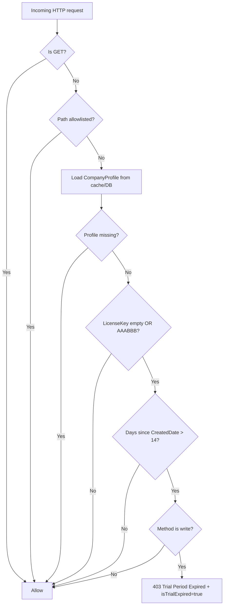
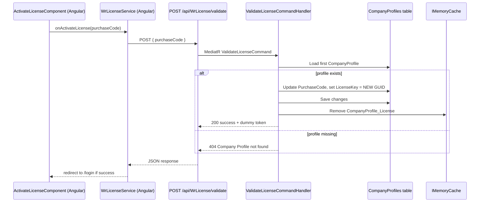

# Licensing System – Architecture & Workflows (Current State)

## Scope

This document summarizes the licensing implementation as discovered in:

- f:\MIllyass\pos-with-inventory-management\SourceCode\Angular
- f:\MIllyass\pos-with-inventory-management\SourceCode\SQLAPI

It focuses on:

- Trial enforcement
- License activation/validation flows
- Tenant (Cloud) license metadata management
- Known gaps that affect renewal and “perpetual” (superAdmin/Master) behavior

## Deployment Modes

The backend supports two operational modes configured by appsettings:

- Desktop: Single-tenant, SQLite (see appsettings.Desktop.json)
- Cloud: Multi-tenant, PostgreSQL + tenant resolution (see appsettings.Cloud.json)

Licensing enforcement behavior is currently implemented in one middleware and applies to both modes.

## Key Components

### Angular (Front-End)

- License activation UI:
  - ActivateLicenseComponent: f:\MIllyass\pos-with-inventory-management\SourceCode\Angular\src\app\activate-license\activate-license.component.ts
- License API client:
  - WrLicenseService: f:\MIllyass\pos-with-inventory-management\SourceCode\Angular\src\app\core\services\wr-license.service.ts
- Trial-expired UX redirect:
  - HttpRequestInterceptor: f:\MIllyass\pos-with-inventory-management\SourceCode\Angular\src\app\http-request-interceptor.ts
  - SubscriptionComponent: f:\MIllyass\pos-with-inventory-management\SourceCode\Angular\src\app\subscription\subscription.component.ts

### SQLAPI (Back-End)

- Licensing endpoints:
  - WrLicenseController (POST /api/WrLicense/validate): f:\MIllyass\pos-with-inventory-management\SourceCode\SQLAPI\POS.API\Controllers\WrLicense\WrLicenseController.cs
  - CompanyProfileController (POST /api/CompanyProfile/activate_license): f:\MIllyass\pos-with-inventory-management\SourceCode\SQLAPI\POS.API\Controllers\CompanyProfile\CompanyProfileController.cs
- License “validation” handler:
  - ValidateLicenseCommandHandler: f:\MIllyass\pos-with-inventory-management\SourceCode\SQLAPI\POS.MediatR\WrLicense\Handler\ValidateLicenseCommandHandler.cs
- Trial enforcement:
  - TrialEnforcementMiddleware: f:\MIllyass\pos-with-inventory-management\SourceCode\SQLAPI\POS.API\Middleware\TrialEnforcementMiddleware.cs
  - Registered in pipeline: f:\MIllyass\pos-with-inventory-management\SourceCode\SQLAPI\POS.API\Startup.cs
- Seed-time “trial markers”:
  - AppConstants.Seeding.DefaultLicenseKey = AAABBB: f:\MIllyass\pos-with-inventory-management\SourceCode\SQLAPI\POS.Common\AppConstants.cs
  - TenantRegistrationService seeds CompanyProfile with AAABBB: f:\MIllyass\pos-with-inventory-management\SourceCode\SQLAPI\POS.Repository\Tenant\TenantRegistrationService.cs
- Cloud tenant license metadata management (not enforced):
  - TenantsController update license + key generation endpoints:
    - f:\MIllyass\pos-with-inventory-management\SourceCode\SQLAPI\POS.API\Controllers\TenantsController.cs
  - GenerateTenantLicenseKeysCommandHandler:
    - f:\MIllyass\pos-with-inventory-management\SourceCode\SQLAPI\POS.MediatR\Tenant\Handlers\GenerateTenantLicenseKeysCommandHandler.cs
  - UpdateTenantLicenseCommandHandler:
    - f:\MIllyass\pos-with-inventory-management\SourceCode\SQLAPI\POS.MediatR\Tenant\Handlers\UpdateTenantLicenseCommandHandler.cs

## Data Model (Licensing-Relevant)

### CompanyProfile (per-tenant)

Source: f:\MIllyass\pos-with-inventory-management\SourceCode\SQLAPI\POS.Data\Entities\CompanyProfile.cs

- LicenseKey: string
- PurchaseCode: string
- CreatedDate: DateTime (from BaseEntity)
- TenantId: Guid (from BaseEntity)

### Tenant (cloud metadata only)

Source: f:\MIllyass\pos-with-inventory-management\SourceCode\SQLAPI\POS.Data\Entities\Tenant\Tenant.cs

- LicenseType: string (default: Trial; enum exists elsewhere with Trial/Paid)
- TrialExpiryDate: DateTime?
- SubscriptionStartDate / SubscriptionEndDate (not used by enforcement)
- SubscriptionPlan (not used by enforcement)

## Current End-to-End Workflows

### 1) Trial Enforcement (Runtime)

Behavior is implemented entirely in TrialEnforcementMiddleware. Key logic:

- If request is GET, it is always allowed (no enforcement).
- Otherwise, it attempts to load CompanyProfile into IMemoryCache using a single cache key: CompanyProfile_License.
- Trial mode is detected by:
  - LicenseKey is empty OR LicenseKey == AAABBB
- If trial and (UtcNow - CompanyProfile.CreatedDate) > 14 days:
  - Block all write operations (POST/PUT/DELETE/PATCH) with 403 and payload { isTrialExpired: true }.

### 2) “Validate License” (Front-end activation screen)

Angular activation uses WrLicenseService:

- POST { purchaseCode } to /api/WrLicense/validate
- If response.success is true:
  - localStorage.license_key = purchaseCode
  - navigate to /login

Backend handler (ValidateLicenseCommandHandler) currently:

- Accepts any non-empty purchaseCode
- Generates a random GUID licenseKey
- Stores purchaseCode and licenseKey in the first CompanyProfile found
- Clears cache CompanyProfile_License
- Returns a dummy bearer token string

### 3) “Activate or Update License Key” (Alternate API)

There is a second activation endpoint:

- POST /api/CompanyProfile/activate_license (AllowAnonymous)
- Payload: { purchaseCode, licenseKey }
- Handler simply stores both strings.

This endpoint is not the one used by the Angular activation screen today.

### 4) Cloud: Tenant License Metadata (Admin-only APIs)

SuperAdmin can:

- PUT /api/Tenants/{id}/license to set Tenant.LicenseType (Trial/Paid)
- POST /api/Tenants/{id}/license/generate to generate GUID license/purchase codes and store into CompanyProfile

Important: these fields are not currently used by TrialEnforcementMiddleware, so updating Tenant.LicenseType does not affect runtime enforcement.

## Observed Architectural Properties (Current State)

- Single enforcement point: TrialEnforcementMiddleware
- License “validation” is implemented as a placeholder and does not validate ownership
- Activation/renewal paths are not consistently allowlisted by the trial middleware
- Multi-tenant cache key is not tenant-scoped (high impact for cross-tenant correctness)

